# cap1tal — огляд застосунку

Мова документа — українська, як і в [tech-task.md](tech-task.md): це робочий документ власника.

**Для чого цей файл.** Прочитавши його, можна зорієнтуватись, що застосунок уже вміє, як він
влаштований усередині і куди класти нову функціональність. Це **карта**, а не джерело правди:
правда про продукт — [product-vision.md](product-vision.md), правда про терміни —
[glossary.md](glossary.md), правда про поведінку — специфікації в `openspec/specs/`. Розбіжність
між цим файлом і ними — привід оновити цей файл.

**Скріншоти.** Усі знімки нижче зроблено на емуляторі Pixel 10 Pro (Android 16, темна тема) з
**синтетичних демо-даних**: вигаданий експорт Saldo на 82 транзакції за червень–вересень 2026,
завантажений через звичайний екран імпорту. Жодних справжніх фінансових даних тут немає.

**DOCX.** `node scripts/build-overview-docx.mjs` збирає з цього файлу і знімків один
`docs/app-overview.docx` — щоб документ можна було переслати або роздрукувати. Він
gitignored: джерело — цей markdown, docx перезбирається.

---

## 1. Що це за застосунок

Персональний облік грошей для однієї людини з одним основним телефоном. Два питання, на які він
має відповідати (§1 візії):

- **«Куди пішли гроші цього місяця?»**
- **«Скільки я ще можу витратити?»**

Працює офлайн з локальною базою SQLite. Назовні йдуть лише запити до monobank API з токеном
власника (транзакції, баланси, курс). Жодного акаунта cap1tal, спільного доступу, аналітики чи
серверної частини. Інші люди можуть встановити застосунок собі — нічого персонального не зашито.

Стек зафіксовано і не переглядається: Expo / React Native, TypeScript, SQLite + Drizzle ORM, npm,
Android-перш (iOS не збирається, але ніщо в моделі не має йому заважати).

---

## 2. Словник у двох словах

Повний словник — [glossary.md](glossary.md); тут лише те, без чого не читаються скріншоти.

| Термін | Що це |
|---|---|
| **рахунок** | місце, де лежать гроші: картка, банка, готівка, інвестиційний рахунок, борг людини |
| **вид рахунку** | `spending` / `savings` / `investment` / `cash` / `debt` — вирішує, як переказ **на** цей рахунок рахується в місяці |
| **транзакція** | один рух грошей: **витрата** (за замовчуванням), **дохід**, **переказ**, **повернення**, **коригування** |
| **категорія** / **джерело** | мітка витрати / мітка доходу; плоскі списки власника |
| **правило** | «продавець або MCC → категорія», застосовується до імпорту |
| **ліміт** | місячна стеля по категорії; перевищення — червоне, нічого не блокує |
| **ціль** | одна з двох: **ціль-накопичення** («накопичити N», необов'язкова дата, склад із одного чи кількох рахунків; прогрес = сума внесків складу) або **ціль витрат** («не перевищити N цього місяця»), яка і **є** ліміт своєї категорії |
| **чернетка** | запропонована транзакція, про яку власник ще не сказав ні слова; грошей не рухає |
| **місячна картина** | витрачено / інвестовано / відкладено / позичено / дохід / **залишилось** за календарний місяць |

Головна формула місяця:

```
залишилось = дохід − витрачено − інвестовано − відкладено − позичено
```

Гроші, покладені в банку або позичені комусь, не виглядають доступними — у цьому й сенс.
Усі числа рахуються **окремо по кожній валюті**; приблизна гривня — вторинна і лише для показу.

---

## 3. Екрани

П'ять вкладок у порядку, у якому їх називає технічне завдання: **Головний**, **Місяць**,
**Рахунки**, **Звіти**, **Налаштування**. Усе інше — екрани, що виїжджають поверх вкладок
(`Stack` у [_layout.tsx](../src/app/_layout.tsx)), а не шості вкладки.

### 3.1. Перший запуск

  

Пристрій, на якому ще нічого немає, відкривається на «Перші кроки»
([onboarding.tsx](../src/app/onboarding.tsx)). Екран **нічого не пише в базу** — він лише називає
стан кожного кроку і веде на екран, який цей стан змінює:

1. **Рахунки** — без жодного рахунку записати транзакцію нема куди.
2. **Історія з Saldo** — разовий імпорт, необов'язковий.
3. **monobank** — токен і зв'язування рахунків.
4. **Сповіщення банків** — дозвіл пояснюється **до** того, як його просять.

Праворуч — той самий екран після імпорту: «Готово 2/4». Пізніше він доступний з
«Налаштування → Перші кроки».

### 3.2. Головний — стан місяця за кілька секунд

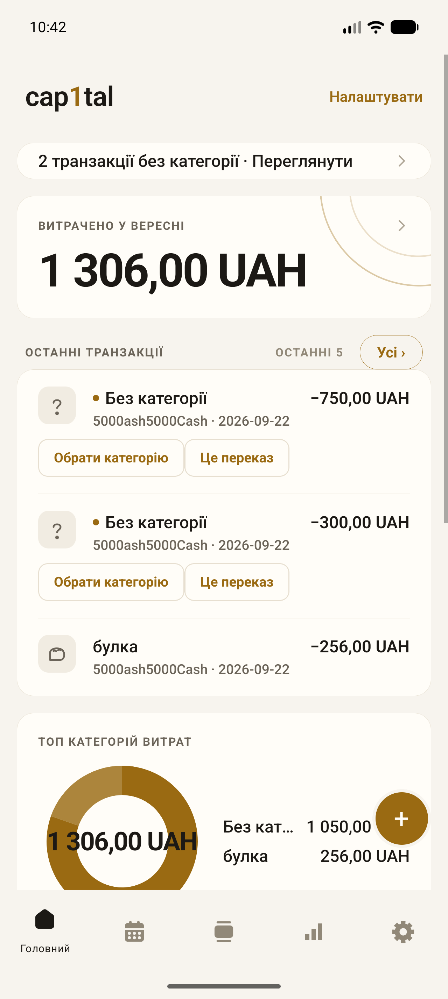 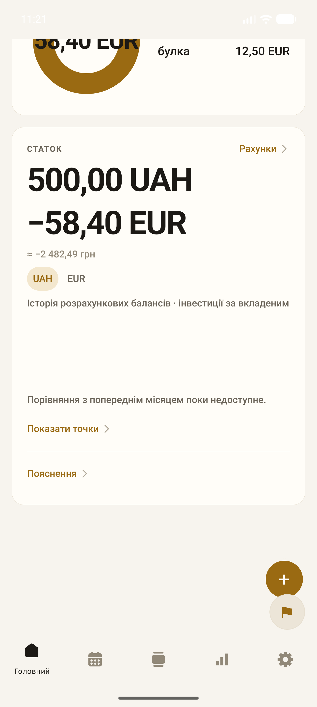 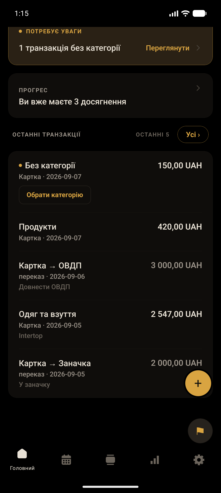

[src/app/(tabs)/index.tsx](<../src/app/(tabs)/index.tsx>) · спека `main-screen`

Зверху — **місячний статус**: «Залишилось у вересні» головною цифрою і «Витрачено» під ним, по
кожній валюті окремо, з тими самими числами, які показує «Місяць» (тап по картці туди й веде).
Якщо за місяць ще немає доходу, там же стоїть речення, чому «залишилось» від'ємне. Під рискою —
вторинний рядок **«На рахунках …»** з приблизною гривнею; тап веде на «Рахунки».

Під ним — **рядок свіжості**: `оновлено 3 хв тому`, і тільки для власника, у якого є токен
monobank і хоч один зв'язаний рахунок. Це вік найсвіжішої завершеної синхронізації серед
зв'язаних рахунків — до хвилини «щойно», до доби хвилини й години, далі ті самі слова, якими
момент називає екран monobank. Поки триває синхронізація, рядок каже саме це.

**Потягнути вниз** — примусова синхронізація: тихий інтервал стосується лише прогонів, яких
власник не просив, а це прогін, який він попросив. Без токена чи без зв'язаного рахунку жест
просто перечитує сховище: жодного запиту, жодної відмови.

Далі — **«Потребує уваги»**, і тільки якщо є що: скільки транзакцій без категорії (тап →
«Транзакції»), чернетки зі сповіщень банків, які підтверджують або відхиляють просто тут, і
**monobank — але лише коли є що робити**: відхилений токен показується одразу (полагодити може
тільки власник), будь-яка інша невдача — аж коли жоден рахунок не синхронізувався понад добу.
Метро й ліфти сюди не потрапляють. Немає жодного з трьох — секції немає взагалі, разом із
заголовком.

Нижче — стрічка **останніх 5** транзакцій і кнопка **«Усі ›»**. У стрічці видно все, що застосунок
вважає важливим:

- **«Без категорії»** підсвічено крапкою і має кнопку «Обрати категорію» — категоризація в один
  тап: спершу п'ять категорій, до яких власник тягнувся востаннє, решта за кнопкою «Всі категорії
  (N)» з пошуком;
- дохід — зеленим, переказ — рядком `рахунок → рахунок`, коригування — зі знаком;
- категорія, що перевищила свій ліміт цього місяця, — червоним.

Тап по транзакції відкриває редагування (§3.9).

Форми на Головному немає: записує **«+»** у правому нижньому куті — окремий екран
[transaction/new.tsx](<../src/app/transaction/new.tsx>) з тим самим типом, рахунком, сумою, датою,
категорією й описом, що були тут раніше. За замовчуванням це **витрата** — «будь-яка транзакція є
витратою, доки її явно не типізували інакше». Після запису екран лишається відкритим з
підтвердженням і порожньою сумою, щоб наступну витрату дня можна було записати одразу.

**Довгі списки на форму не виїжджають.** Рахунок, категорія і джерело показують щонайбільше п'ять
варіантів — ті, до яких власник тягнувся востаннє, добиті з початку списку, — а решта стоїть за
однією кнопкою «Всі рахунки (N)» / «Всі категорії (N)» / «Всі джерела (N)», яка називає, скільки
їх усього. Вона розгортає повний список із пошуком по назві; вибір згортає його назад, а
апаратний «назад» спершу закриває список і лише потім іде з екрана. Обране завжди видно, навіть
якщо це архівний рахунок, на якому вже стоїть збережена транзакція, і чипи не переставляються
під пальцем. Те саме — на редагуванні транзакції (§3.9), яке раніше малювало всі списки цілком.

 

Ліворуч — «+»: п'ять рахунків і п'ять категорій, до яких власник тягнувся востаннє, кожен список
за своєю кнопкою «Всі … (N)». Праворуч — та сама категорія розгорнута: поле пошуку зверху, під ним
увесь список, обране лишається на місці.

### 3.3. Місяць — куди пішли гроші і скільки лишилось

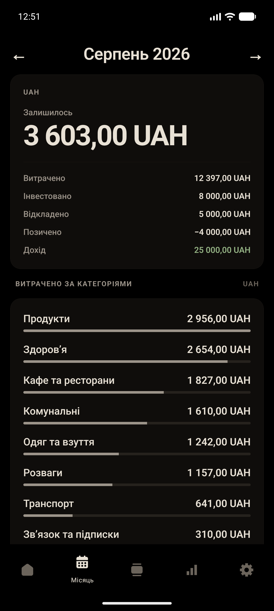 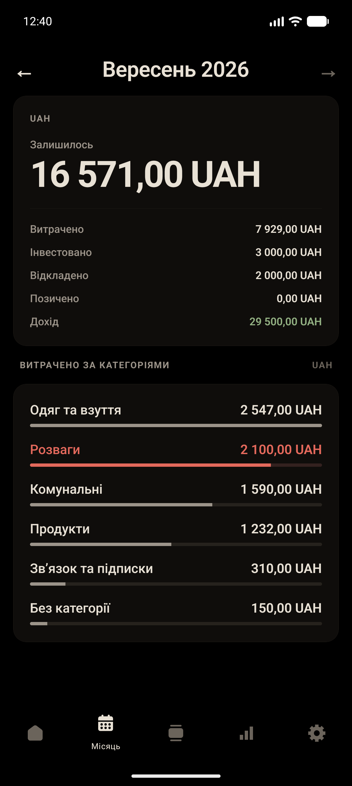 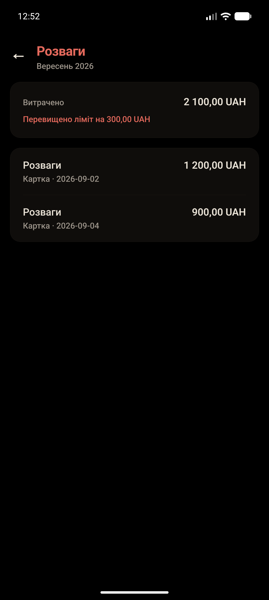

[src/app/(tabs)/month.tsx](<../src/app/(tabs)/month.tsx>) · спеки `month-screen`, `monthly-picture`

П'ять чисел місяця плюс дохід, окремою карткою на кожну валюту. Ліворуч — серпень 2026:
`Позичено −4000,00` — це повернений борг, тому число від'ємне; `Відкладено 5000,00` — переказ у
банку; `Інвестовано 8000,00` — переказ на військові облігації. Посередині — поточний місяць, у
якому минув один день: стрілки ← → гортають місяці.

Під числами — **витрачено за категоріями**: смужка кожного рядка масштабована до найбільшої
категорії місяця, категорія понад ліміт — червона. Тап по рядку відкриває цю категорію за цей
місяць (праворуч) з підписом, на скільки саме перевищено ліміт.

### 3.4. Рахунки — де лежать гроші

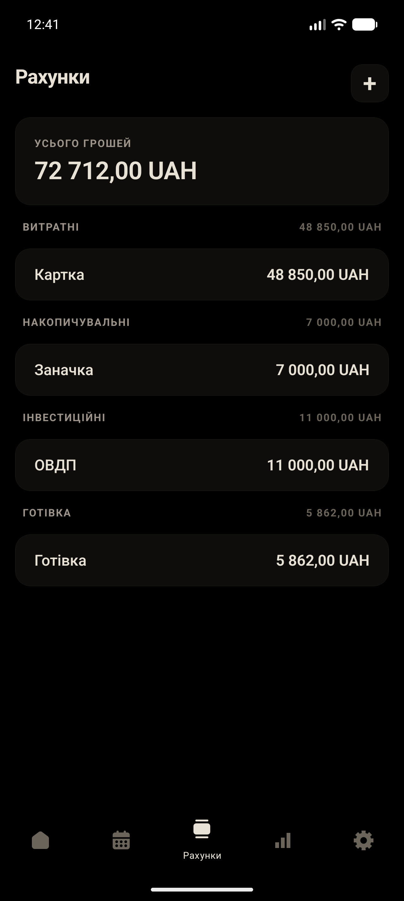 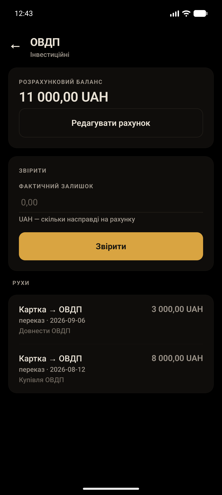 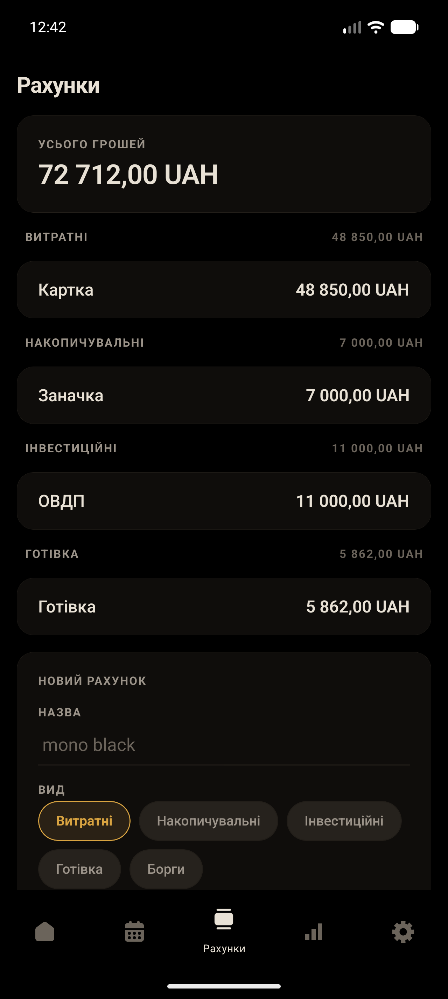

[src/app/(tabs)/accounts.tsx](<../src/app/(tabs)/accounts.tsx>),
[account/&#91;id&#93;.tsx](<../src/app/account/[id].tsx>) · спеки `accounts-screen`, `accounts`

Рахунки згруповані за видом, у кожної групи — власний підсумок по валютах. **Баланс завжди
розрахунковий**: початковий залишок плюс усі транзакції. Балансів, які не пояснюються
транзакціями, не існує. Для рахунку, зв'язаного з monobank, тут же поруч показується останній
відомий **баланс банку** — поруч, а не замість: банк ніколи не перезаписує розрахункове число.

Тап по рахунку відкриває його рухи (посередині) з полем **«Звірити»**: власник вводить фактичний
залишок, і застосунок створює транзакцію-коригування на різницю.

Праворуч — форма нового рахунку: назва, вид, валюта, початковий залишок. Вид і валюта після
створення не змінюються (це змінило б сенс усієї історії рахунку); назву і початковий залишок
редагувати можна. Рахунки не видаляються — лише архівуються.

### 3.5. Звіти — історія та цілі

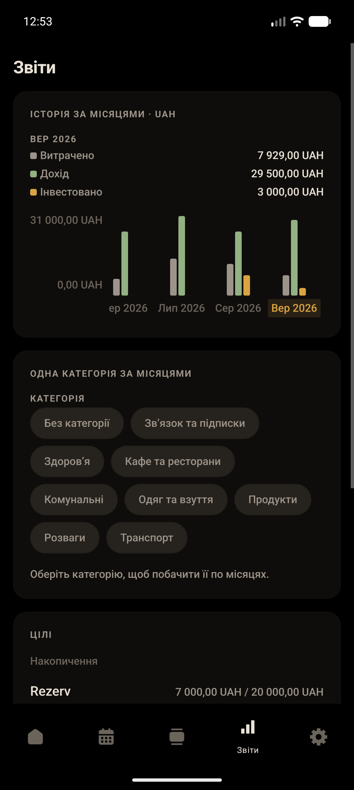 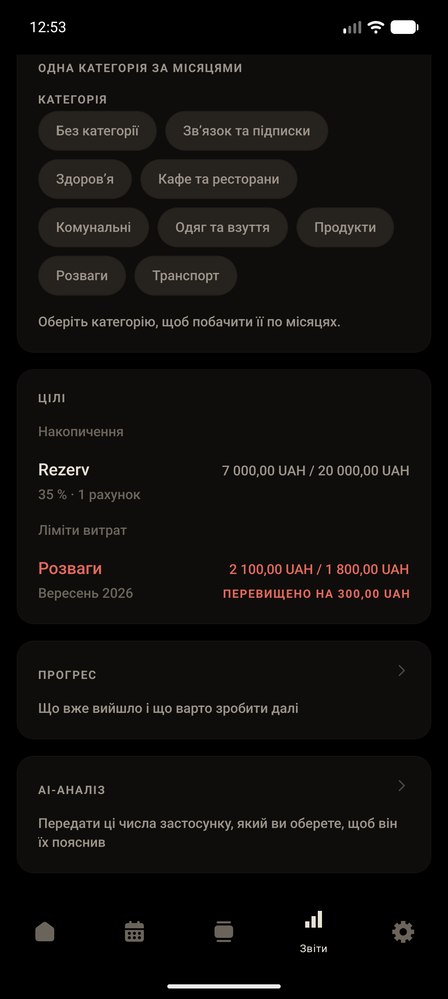

[src/app/(tabs)/reports.tsx](<../src/app/(tabs)/reports.tsx>) · спеки `reports-screen`, `reports`

Три секції:

1. **Історія за місяцями** — витрачено / дохід / інвестовано за весь час, стовпчиками. Кожен графік
   називає свою шкалу (максимум і нуль), а один місяць — вибраний — розписано числами повністю,
   бо стовпчик без числа нічого не доводить.
2. **Одна категорія за місяцями** — обрана категорія по всій історії.
3. **Цілі** — двома окремими групами, бо це протилежні речі. **Накопичення**: прогрес як «скільки
   є / скільки треба», відсоток, дата (якщо є) і скільки рахунків рахується; приблизний прогрес
   позначено «≈», а невідомий курс ховає прогрес цілком. **Ліміти витрат**: витрачено / стеля за
   поточний місяць і скільки ще можна витратити — або на скільки перевищено, і тоді жодного
   відсотка. Рядок накопичення відкриває свій розбір (`goal/[id]`), рядок ліміту — місяць його
   категорії.

Перемикач валюти вгорі: кожна валюта читається окремо, нічого не конвертується.

### 3.6. AI-аналіз — попросити асистента пояснити числа

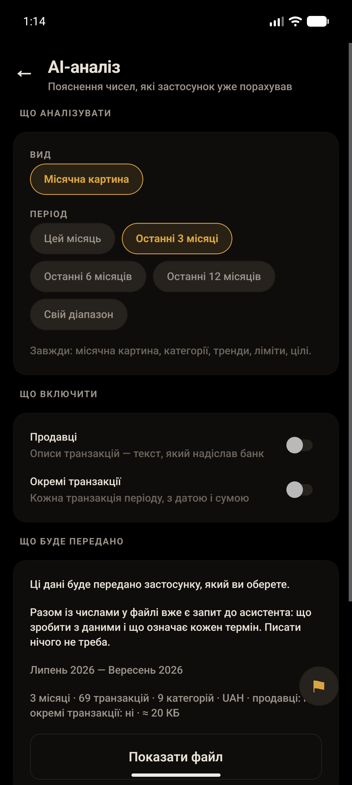 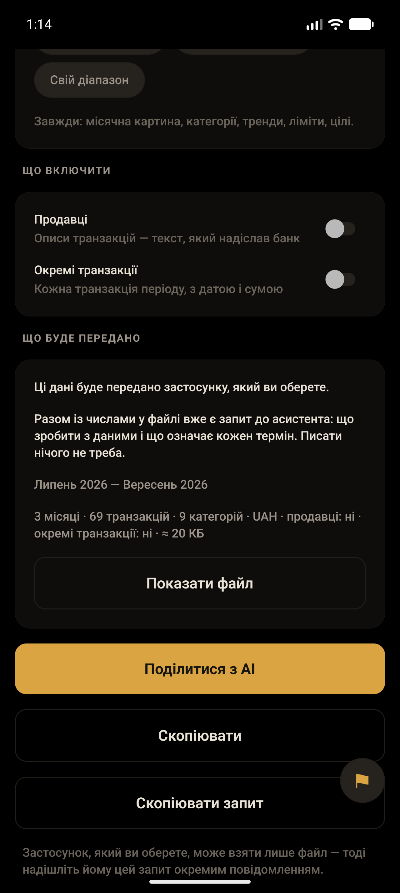

[src/app/ai-analysis.tsx](../src/app/ai-analysis.tsx) · спеки `ai-analysis-screen`,
`ai-analysis-package`, `ai-analysis-share`

Відкривається зі «Звітів». Числа рахує застосунок — асистент лише читає їх уголос: що змінилося,
які категорії зросли, що виглядає необов'язковим. Він нічого не рахує, нічого не змінює і жодного
числа в застосунку не бачить, крім тих, що вже пораховані.

Власник обирає **вид** («Місячна картина»), **період** («Цей місяць», 3, 6, 12 місяців або свій
діапазон цілих місяців) і два перемикачі, обидва **вимкнені** щоразу, коли екран відкривається:
«Продавці» (описи транзакцій — текст банку) і «Окремі транзакції». Агрегати — місячна картина,
категорії, тренди, ліміти й цілі — включені завжди.

**Що з телефона не виходить ніколи:** жоден ідентифікатор, жодна назва рахунку, токен monobank,
баланс банку, текст перехоплених сповіщень, чернетки, відстежувані застосунки і бекап. Описи й
окремі транзакції виходять лише тоді, коли власник увімкнув їх для цього одного запуску, і це
ніде не запам'ятовується.

**Що тримає файл для аналізу — п'ять розділів, у цьому порядку.** Перший — **«Запит»**: звичайною
українською сказано, що це пакет фінансових даних із cap1tal, названо вид і період, і попрошено
проаналізувати дані та дати власникові практичний фінансовий огляд. Він стоїть вище за машинний
заголовок (`cap1tal.analysis-package · версія 1 · …`) і вище за будь-яке число: файл приходить у
чужий застосунок як вкладення, і те, що асистент читає першим, — це початок файлу. Далі —
інструкції асистентові (користуйся лише цими даними, нічого не вигадуй, нічого не перераховуй, не
поєднуй валюти, не прогнозуй; дивись на зміни від місяця до місяця, найбільші категорії, те, що
виділяється на тлі попередніх місяців, і на ліміти й цілі), контекст із визначеннями шести чисел,
розрізнень зі словника, ліміту й цілі, читабельний підсумок і сам пакет як JSON. Якщо власник
увімкнув «Продавці» чи «Окремі транзакції», інструкції отримують ще по рядку — що це контекст
поруч з агрегатами, який не можна підсумовувати; вимкнений перемикач не лишає по собі жодного
рядка.

Перед тим як щось піде кудись, екран показує **прев'ю того самого пакета**, який і буде передано:
скільки місяців, транзакцій, категорій, які валюти, продавці так/ні, окремі транзакції так/ні і
приблизний розмір у КБ — плюс «Показати файл», який показує текст цілком, від «## Запит» і до
кінця. Прев'ю також каже, що **запит до асистента вже всередині файлу разом із числами** і писати
нічого не треба. Нічого не залишає телефон, доки власник не натисне «Поділитися з AI»: тоді
відкривається **системний вибір застосунків**, і застосунок обирає власник. Телефон не каже, що
власник там зробив, тому екран каже рівно «Файл передано системі» і нічого більше.

Поруч завжди є дві копії: «Скопіювати» — весь файл у буфер, і **«Скопіювати запит»** — самі лише
одне-два речення короткого запиту, для випадку, коли обраний застосунок узяв вкладення і нічого
більше. Під ними стоїть пояснення, ще до того як їх натиснуть: «Застосунок, який ви оберете, може
взяти лише файл — тоді надішліть йому цей запит окремим повідомленням.» Жоден асистент ніде не
названий. Короткий запит **за задумом ненадійний**: `expo-sharing` не вміє передати текст разом із
файлом, тож сьогодні його не несе жоден адаптер, екран це знає і ніколи не каже, що запит кудись
пішов. Правду тримає сам файл, який і так відкривається своїм «Запитом».

### 3.7. Транзакції — уся історія і пошук

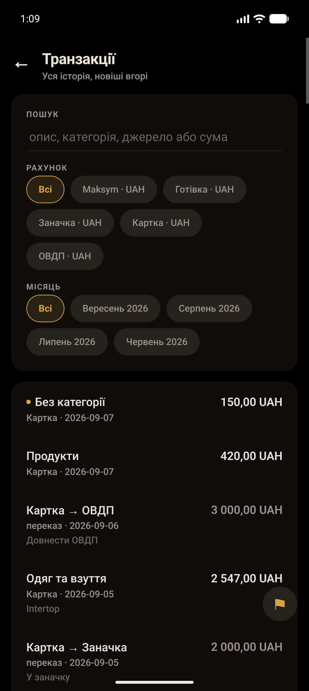

[src/app/transactions.tsx](../src/app/transactions.tsx)

Стрічка Головного показує останні 50 — цього достатньо щодня і замало, щоб знайти щось за липень.
Цей екран тримає всю історію з пошуком за описом, категорією, джерелом або сумою і фільтрами за
рахунком та місяцем.

### 3.8. Налаштування — усе, що налаштовується

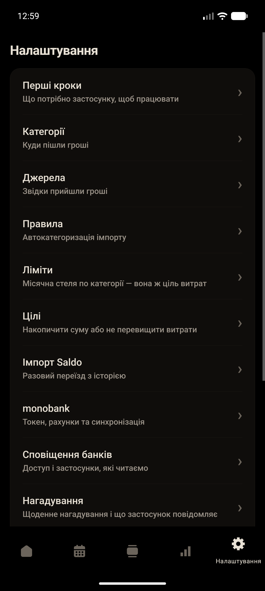

[src/app/(tabs)/settings.tsx](<../src/app/(tabs)/settings.tsx>),
[src/ui/settings-sections.ts](../src/ui/settings-sections.ts) · спека `settings-screen`

Вкладка — це список розділів, кожен з яких живе за адресою `/manage/…` і відкривається поверх
вкладок. Сам список описано **даними, а не JSX** (`SETTINGS_SECTIONS`), щоб `npm run verify`, який
ніколи не запускає екран, міг перевірити, що всі розділи на місці.

### 3.9. Редагування транзакції

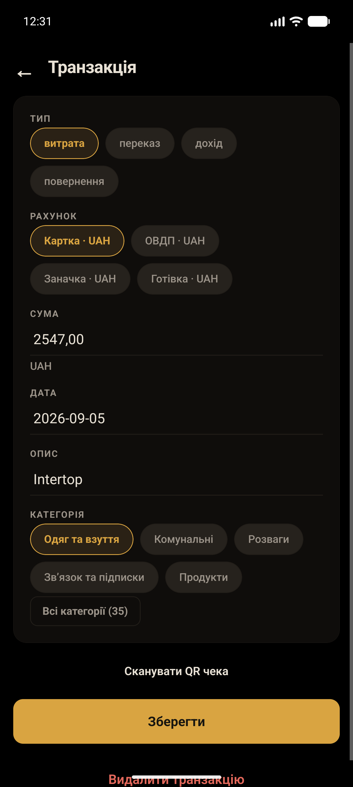

[transaction/&#91;id&#93;.tsx](<../src/app/transaction/[id].tsx>)

Та сама форма, що й швидке додавання, плюс видалення. Зміна типу (витрата → переказ або
інвестиція) — штатна щоденна дія, а не виняток: саме так імпортована «витрата» стає переказом на
банку.

Тут же — **фіскальний чек**. Витрата чи повернення без чека пропонує «Сканувати QR чека»
([transaction/scan.tsx](../src/app/transaction/scan.tsx)) — помітніше для витрати в засіяній
категорії «Продукти», тихіше в інших. Сканер читає QR з паперового чека, застосунок питає
податкову за реквізитами, показує позиції з сумою і чекає рішення власника; збігу сум немає —
питає ще раз, перш ніж прикріпити. Транзакція, яка вже має чек, показує рядок «Фіскальний чек · N
позицій · сума» і веде до списку позицій ([transaction/receipt.tsx](../src/app/transaction/receipt.tsx)),
де чек можна відкріпити. Переказ, дохід і коригування сканування не пропонують — але чек, який
вони отримали до зміни типу, лишається видимим.

Чек — це **деталь під транзакцією, а не гроші**: жоден розрахунковий баланс, жодне число місячної
картини, жоден ліміт, ціль чи звіт від нього не змінюються, і жодна позиція не стає транзакцією.

---

## 4. Налаштування по розділах

### 4.1. Категорії, Джерела

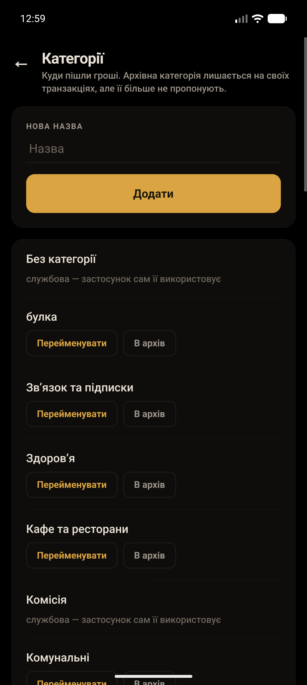

[manage/categories.tsx](../src/app/manage/categories.tsx),
[manage/sources.tsx](../src/app/manage/sources.tsx) · спека `categories`

Плоскі списки з стартовим набором власника (його ж категорії з Saldo, ієрархія розплющена).
Створення, перейменування, архівація; **видалення немає** — архівна категорія лишається на своїх
транзакціях, але більше не пропонується. Службові рядки («Без категорії», «Комісія»,
«Коригування», «Відсотки», «Без джерела») не перейменовуються і не архівуються — застосунок сам
на них посилається.

### 4.2. Правила


[manage/rules.tsx](../src/app/manage/rules.tsx) · спека `categorisation-rules`

«Продавець і/або MCC → категорія». Застосовуються до імпортованих транзакцій; збіг
детермінований, найточніше правило виграє. Сходинки точності: продавець **і** MCC → лише
продавець → лише MCC; за однакової точності виграє довший шаблон продавця, потім новіше правило.
Правило без жодного критерію не створюється.

### 4.3. Ліміти і Цілі

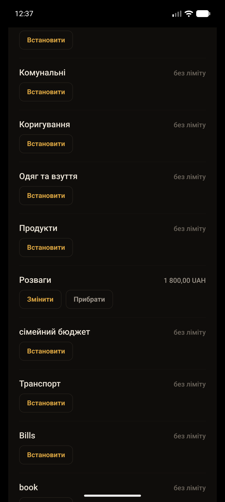 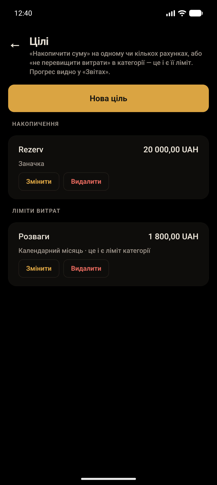

[manage/limits.tsx](../src/app/manage/limits.tsx),
[manage/goals.tsx](../src/app/manage/goals.tsx) · спеки `limits`, `goals`

Ліміт — не більше одного на категорію, у своїй валюті; порівнюється з витраченим за місяць у тій
самій валюті. Нічого не блокує і нічого не надсилає — лише фарбує червоним.

Ліміт — це і є **ціль витрат** цієї категорії: одна сума під двома назвами, яку ставлять і
знімають з будь-якого з двох місць, тож двох стель бути не може.

Форма цілі спершу питає вид. **Накопичити** — назва, сума у власній валюті цілі, **необов'язкова**
дата і склад: один чи кілька рахунків, які відмічають вручну або ярликами «Усі інвестиційні / 
накопичувальні / готівкові» (ярлик відмічає ті рахунки, що є **на цю мить**, і зберігає їхні id —
створений пізніше рахунок сам до цілі не потрапляє). **Не перевищити витрати** — категорія (з тих,
що ще не мають ліміту), сума і валюта; ні назви, ні дати тут не питають.

Прогрес **читається** з балансів складу — а для інвестиційного рахунку з його поточної вартості —
і ніколи не вводиться руками, тому не може розійтися зі збереженою правдою.

### 4.3a. Розбір цілі — `goal/[id]`

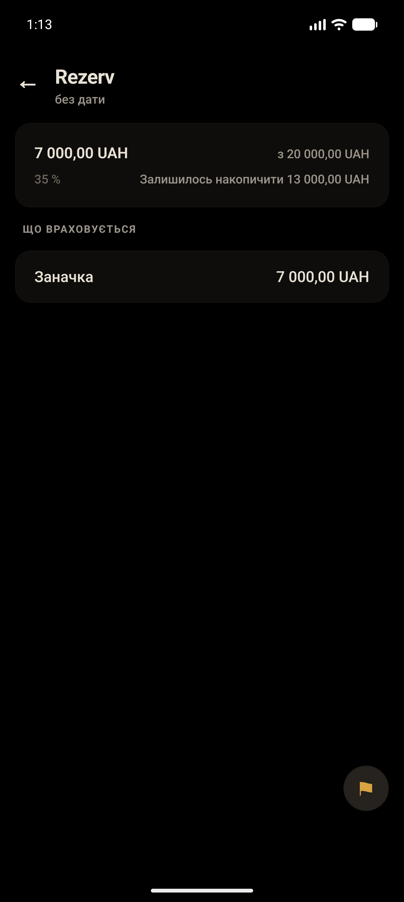

[goal/&#91;id&#93;.tsx](<../src/app/goal/[id].tsx>) · спека `goal-screen`

Екран, який відкривається з рядка накопичення у «Звітах»: прогрес із позначкою «≈», якщо щось
конвертувалося, і внесок **кожного** рахунку складу — своя сума, а поруч приблизний еквівалент у
валюті цілі, «в архіві» для архівного рахунку, «курс невідомий» для того, який порахувати не
вдалося, і поточна вартість із датою для інвестиційного. Коли курсу бракує, тотала й відсотка немає
взагалі — сума прочитаних внесків не видається за прогрес. Екран нічого не записує.

Ціль витрат свого екрана не має: вона відкриває місяць своєї категорії, де її транзакції вже є.

### 4.4. monobank

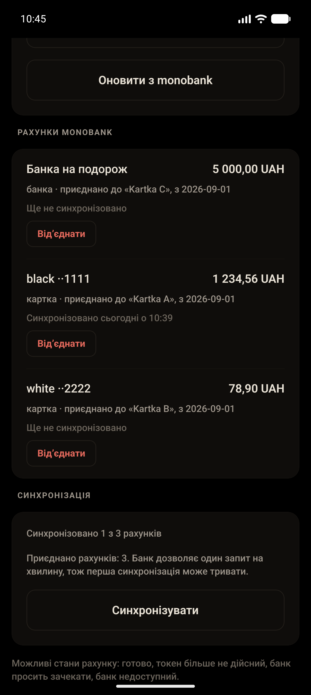

[manage/monobank.tsx](../src/app/manage/monobank.tsx) · спеки `monobank-sync-screen`, `monobank-sync`

Токен зберігається лише в захищеному сховищі телефона (`expo-secure-store`): він не потрапляє ні
в базу, ні в бекап, ні в лог, і показати його вдруге неможливо. Кнопка «Отримати токен» відкриває
сторінку monobank і після повернення підставляє токен з буфера.

Далі — список рахунків monobank, зв'язування кожного з рахунком застосунку **тієї самої валюти**,
і синхронізація: кожен зв'язаний рахунок продовжує з власного збереженого курсора, один елемент
виписки імпортується **щонайбільше один раз, назавжди**. Відключення monobank ніколи не видаляє
історію грошей.

**Синхронізація запускається сама.** Відкрив застосунок або повернувся до нього — і, якщо від
останньої спроби минуло понад 15 хвилин, прогін іде тихо. Чому саме 15: банк дозволяє один запит
на хвилину, прогін коштує `1 + рахунки` запитів, тож чверть години тримає витрату приблизно на
п'ятій частині дозволеного навіть у власника, який відкриває застосунок постійно. Момент останньої
спроби пишеться **до** прогону і переживає перезапуск — інакше десять force-close підряд коштували
б десять запитів.

Прогін завжди один: автоматичний, жест на Головному і «Синхронізувати» проходять через один вхід
із замком, тож два прогони не зіштовхнуться курсорами. Поки триває чужий прогін, цей екран каже
про це і не пропонує ні почати, ні зупинити — зупиняти чужу роботу не його справа. Успішний
автоматичний прогін не каже нічого: транзакції просто з'являються, а рядок свіжості рухається.
Нічого не працює у фоні — застосунок закрито, синхронізації немає.

### 4.5. Сповіщення банків

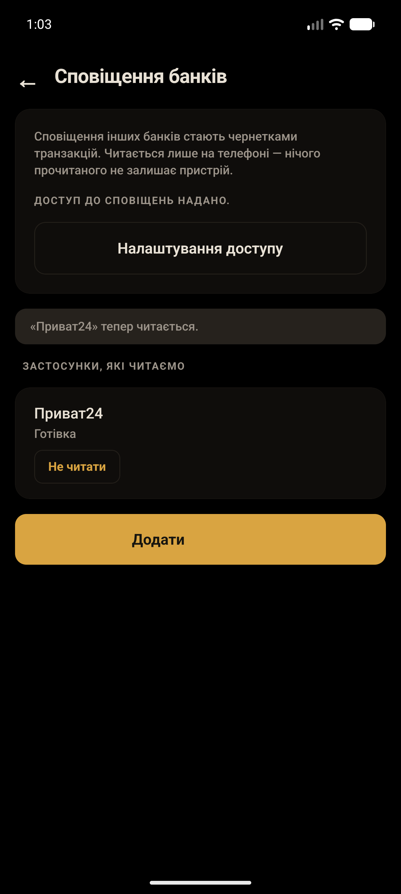 

[manage/notifications.tsx](../src/app/manage/notifications.tsx) · спеки `bank-notifications*`

Як автоматично ловляться банки, у яких немає API. Власник дає Android-дозвіл на читання
сповіщень і додає **відстежувані застосунки**: один застосунок → рівно один рахунок. Сповіщення
всіх інших застосунків не читаються взагалі; застосунки monobank відстежувати заборонено — mono
вже приходить через API з реальними ідентифікаторами, і другий, слабший шлях міг би лише
наробити дублікатів.

Розібране сповіщення стає **чернеткою** на Головному: вона нічого не рухає, доки власник її не
підтвердить. Правило може підтвердити розібрану витрату автоматично. Нічого з прочитаного не
залишає телефон і не потрапляє в бекап.

### 4.6. Нагадування

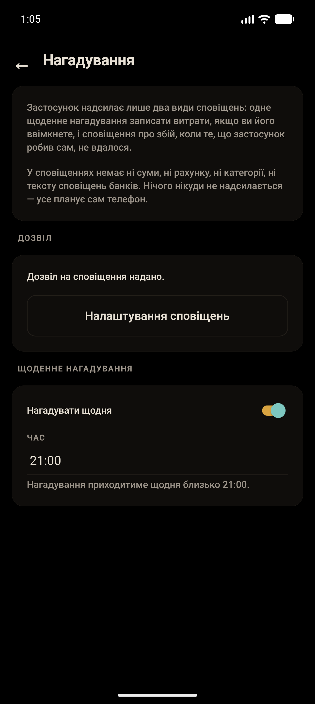

[manage/reminders.tsx](../src/app/manage/reminders.tsx)

Застосунок надсилає рівно два види сповіщень: одне щоденне нагадування записати витрати (якщо
ввімкнути, у вибраний час) і сповіщення про збій, коли те, що застосунок робив сам, не вдалося.
У жодному з них немає ні суми, ні рахунку, ні категорії, ні тексту банківського сповіщення.
Віддалених push-сповіщень немає — усе планує сам телефон.

### 4.7. Бекап


[manage/backup.tsx](../src/app/manage/backup.tsx)

Один файл з усіма рахунками, транзакціями, списками та налаштуваннями. **Не зашифрований** — хто
має файл, той бачить гроші. Відновлення **замінює** все, що зараз на телефоні, без злиття і без
скасування, тому спершу пропонується зберегти поточний стан. Токен monobank, чернетки і тексти
сповіщень у бекап не потрапляють ніколи.

### 4.8. Імпорт Saldo

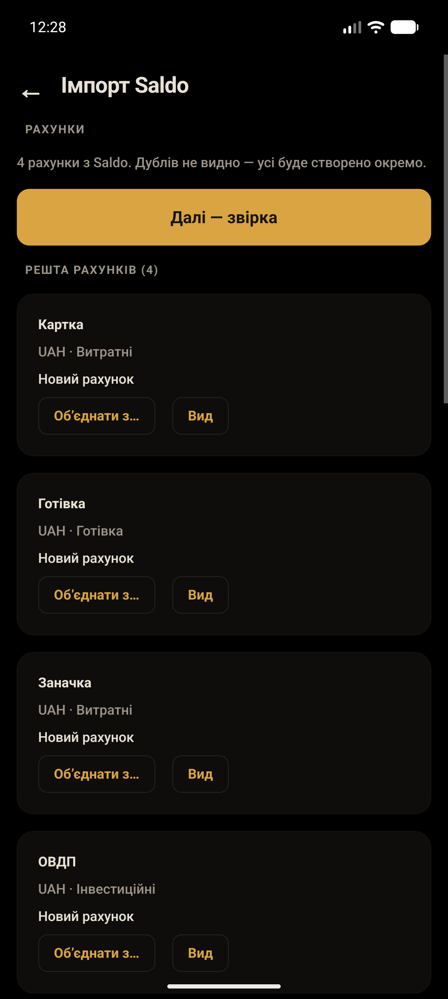 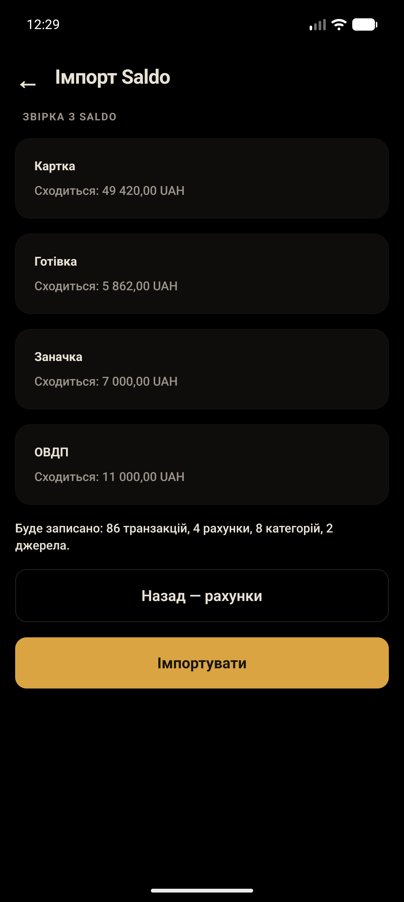 

<!-- 26-saldo-import-map.png ще показує старий екран із фішками; його перезнято після димового
     прогону на емуляторі (задача 6.2 зміни saldo-import-compact-map). -->

[manage/saldo-import.tsx](../src/app/manage/saldo-import.tsx) · спеки `saldo-import-screen`, `saldo-import`

Разовий переїзд з попереднього застосунку. Майстер показує, що саме він зробить, **перш ніж
зробити хоч що-небудь**:

1. **Рахунки** — компактний список: по одному рядку на пару (рахунок Saldo, валюта), у ньому
   назва, валюта, вид і один рядок стану — «Новий рахунок», «Об'єднується з «…»» або «Додається до
   наявного «…»». У спокої не намальовано жодної фішки: і види, і рахунки для об'єднання
   з'являються лише тоді, коли власник відкриє їх на своєму рядку, і відкритим лишається завжди
   один редактор — апаратне «назад» закриває його раніше, ніж покине крок. Список «Об'єднати з…»
   пропонує **тільки рахунки тієї ж валюти** (об'єднання між валютами імпорт усе одно відхиляє),
   найсхожіші за назвою — першими, з пошуком, коли їх більше за п'ять, і «Створити окремий
   рахунок» завжди першим — це і є шлях назад із об'єднання. Там, де дві назви можуть бути лише
   одним рахунком, рядок несе **підказку про дубль** — одне речення «Схоже, це той самий
   рахунок → «…»» з «Об'єднати» та «Ні, окремо» поруч; вона нічого не об'єднує сама, і рядки з
   нею згруповано попереду під «Схоже на дублі (N)». Крок відкривається одним рядком про те, що
   знайдено («23 рахунки з Saldo. 2 схожі на дублі — перевірте їх; решту буде створено окремо.»),
   і «Далі — звірка» стоїть одразу під ним, а не лише в кінці списку: рядок, якого ніхто не
   торкнувся, стає власним новим рахунком, і це повна відповідь.
2. **Нові категорії та джерела** — те, чого ще немає за назвою; кожен рядок можна перенаправити
   на наявний. Наявні відкриваються тим самим одним редактором, що й рахунки вище, і з тим самим
   пошуком, коли їх більше за п'ять.
3. **Звірка** — по кожному рахунку показано баланс за Saldo і баланс за планом імпорту та їхню
   різницю. Транзакція, якої імпорт не розпізнав, потрапляє у звіт, а не зникає мовчки.
4. **Імпорт** — увесь план записується як одне ціле або не записується взагалі; повторний імпорт
   попереджає, що подвоїть історію.

### 4.9. Репорти про помилки

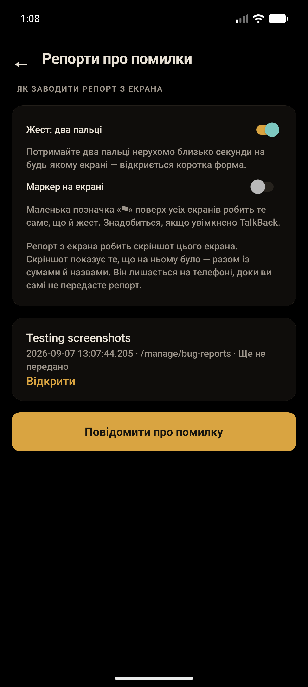 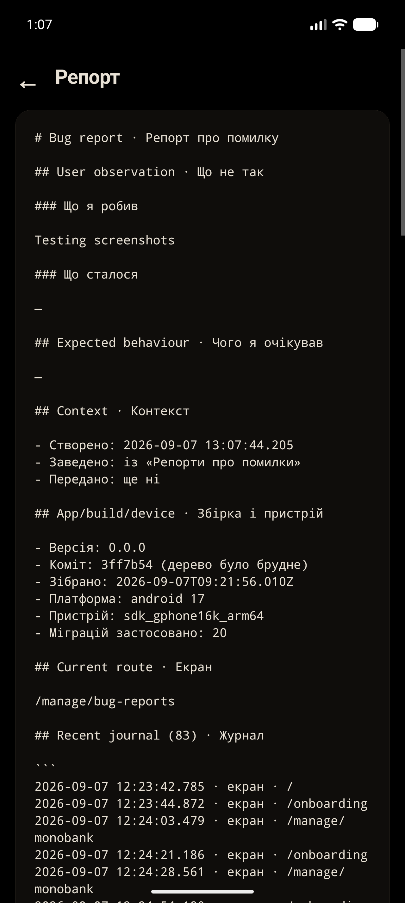


Третій знімок — аркуш репорту, відкритий жестом просто з Головного. Мініатюра в ньому показує
**Головний без самого аркуша**: знімок зроблено до того, як застосунок намалював хоч щось своє.

[manage/bug-reports/index.tsx](../src/app/manage/bug-reports/index.tsx) · спеки `bug-report`,
`bug-report-screen`

Поки застосунок молодий, а тестує його одна людина на одному телефоні, помилка, яку побачили
ввечері, до ранку лишається однією фразою «щось не записалося». Цей розділ дає їй форму.

**Журнал.** Застосунок веде власний обмежений запис того, що робив: кожен відкритий екран (за
маршрутом), кожну дію, яка не вдалася — з точним текстом, який побачив власник, — кожне підняте
чи зняте сповіщення про збій і кожен збій з повідомленням і стеком. Останні 500 записів, старіші
випадають. У журналі ніколи немає ні суми, ні назви, ні опису, ні тексту банківського сповіщення,
ні токена monobank. Єдиний виняток названо прямо: якщо власна відмова застосунку цитує те, що
власник щойно ввів («Рахунок «Картка» вже існує»), цитата лишається в тому одному записі — бо
відтворити помилку без точного тексту не вийде.

**Репорт.** Власник пише три рядки — що робив (обов'язково), що сталося, чого очікував, — а
застосунок сам додає версію і збірку (короткий коміт і чи було дерево чистим), платформу,
пристрій, кількість застосованих міграцій, маршрут екрана, момент, увесь журнал, ту помилку чи
збій, з якого все почалося, походження репорту і кількості того, що на телефоні, — самі числа.
Скріншоти власник додає до вже збереженого репорта — або їх додає сам застосунок, коли репорт
заводять з екрана.

**Звідки він береться.** Будь-який діалог з відмовою пропонує, поруч із «Закрити», «Повідомити
про помилку» — і форма відкривається з тією відмовою вже прикріпленою. Якщо екран узагалі впав,
замість мертвого застосунку показується запасний екран українською з текстом помилки, «Повідомити
про помилку» і «Повернутися». А без жодного приводу репорт заводиться просто тут, у розділі.

**Прямо з того екрана, де проблема.** Четверті двері, і найкоротші. **Жест репорту** — два пальці,
потримані нерухомо близько секунди з чвертю, — працює на будь-якому екрані застосунку: у списку,
прокрученому наполовину, у формі з піднятою клавіатурою, будь-де. Двома пальцями саме тому, що
одним пальцем у застосунку робиться геть усе: жодний дотик, прокручування чи довге натискання не
можуть його зачепити. Поруч є **маркер репорту** — маленька «⚑» поверх усіх екранів, вимкнена за
замовчуванням, яка робить те саме. Він потрібен там, де жест не проходить: з увімкненим TalkBack
багатопальцеві жести забирає система. Обидва перемикачі — вгорі цього розділу.

Спершу знімок, потім усе інше. Застосунок фотографує екран **до** того, як намалює хоч щось своє
(маркер ховається першим, щоб не потрапити у власний знімок), і лише коли знімок готовий —
відкриває **аркуш репорту**: «Що не так?» (обов'язково), «Чого я очікував?» (ні), сам скріншот і
три дії — «Зберегти», «Зберегти й передати», «Скасувати». Більше нічого не питає: «Що я робив»
застосунок пише сам із маршруту. «Скасувати» не лишає нічого — ні репорта, ні скріншота, ні файлу
в кеші; те саме робить жест «назад». Якщо знімок зробити не вдалося, це не відмова: аркуш
відкривається, репорт заводиться, і в ньому українською написано, чому скріншота немає.

**Скріншот — єдине, що може показати гроші.** Усе, що застосунок *пише* в репорт, грошей не
несе: ні суми, ні назви, ні опису, ні тексту банку, ні токена. Скріншот — виняток за своєю
природою: він показує те, що було на екрані, а на екрані цього застосунку зазвичай гроші.
Застосунок його не читає, не тлумачить і не замальовує — він не може знати, які пікселі є сумою, а
обіцянка, якої не дотримати, гірша за чесне попередження. Тому перед будь-якою передачею власнику
показують сам скріншот і кажуть прямо, що на ньому — разом із сумами й назвами; репорт без
скріншота ніяким попередженням не турбують.

**Що звідси виходить.** Нічого — доки власник не скаже. Збережений репорт показано **цілим**: те,
що на екрані, і є те, що піде. «Скопіювати» кладе цей текст у буфер; «Передати» віддає один
Markdown-файл (зі скріншотами всередині) системному вибору застосунків — далі це вже чат із
Claude Code. Жодного сервера, жодної аналітики, жодного автоматичного відсилання. У бекап
репорти і журнал не потрапляють ніколи, і відновлення їх не чіпає.

---

---

## 5. Як влаштовано всередині

### 5.1. Шари

```
src/domain/     чистий TypeScript: гроші, рахунки, транзакції, місячна картина, ліміти, цілі,
                правила, звіти. Нічого не знає про React, базу, мережу і платформу.
src/ui/         чиста логіка екранів без жодного імпорту React: розбір суми, підписи, групування,
                стан майстрів. Саме тут перевіряється те, що виглядає як «поведінка екрана».
src/app/        expo-router: (tabs)/ — п'ять вкладок; transaction/, category/, account/,
                transactions, ai-analysis, manage/, onboarding — екрани поверх вкладок.
src/components/ спільні примітиви UI (форми, поверхні, теми, таби).
src/db/         Drizzle: schema.ts + репозиторії; drizzle/ — міграції (0000…0013).
src/platform/   порти до пристрою і їхні тестові двійники; *-device.ts — нативні адаптери.
src/monobank/   API, розбір виписки, координатор синхронізації, коли синхронізувати самому, курс.
src/notifications/ розбір банківських сповіщень і життєвий цикл чернеток.
src/saldo/      розбір CSV, інтерпретація в транзакції, звірка балансів.
src/fiscal/     фіскальні чеки: читання QR, порт пошуку в податковій і його адаптер, декодування
                windows-1251, два діалекти документа (ПРРО і класичний РРО). Чистий TypeScript.
src/analysis/   пакет для аналізу і файл для аналізу: період, місяці, категорії, тренди, цілі,
                деталі, точний десятковий текст і базисні пункти, текст промпта і рендер файлу.
                Чистий TypeScript; не знає ні про базу, ні про React, ні про мережу.
src/backup/     формат бекапу і канонізація.
src/reminders/  розклад нагадувань і тексти сповіщень.
src/reporting/  журнал (що робив застосунок) і репорт про помилку: збирання, приватність
                (нічого фінансового), рендер у Markdown. Чистий TypeScript.
modules/notification-capture/   локальний Expo-модуль на Kotlin: Android NotificationListener.
```

Правило, яке тримає все це разом: **`npm run verify` ніколи не завантажує нативний модуль і не
запускає React Native**. Тому кожна взаємодія з телефоном — це *порт* (тип + тестовий двійник) в
`src/platform/`, а нативний адаптер лежить у сусідньому файлі, який порт не імпортує. Помилки —
це **значення**, а не винятки: «немає дозволу», «немає такої можливості на цій платформі»,
«користувач скасував» — це відповіді, які екран показує словами власника.

### 5.2. Дані

Одна база SQLite (`cap1tal.db`) у приватному сховищі застосунку, 24 таблиці:

| Група | Таблиці |
|---|---|
| гроші | `accounts`, `transactions` |
| списки | `categories`, `sources`, `rules` |
| бюджет | `category_limits`, `goals` |
| monobank | `monobank_accounts`, `monobank_links`, `monobank_imported_items`, `monobank_rates`, `monobank_sync_attempt` |
| сповіщення | `notification_watches`, `notification_fingerprints`, `notification_drafts` |
| чеки | `fiscal_receipts`, `receipt_items` |
| службове | `saldo_import`, `daily_reminder`, `alerts`, `entry_defaults` |
| репорти | `journal`, `bug_reports`, `bug_report_screenshots` |

Правила бази ([.claude/rules/database.md](../.claude/rules/database.md)):

- **гроші — цілі мінорні одиниці плюс код валюти**. Ніколи не float, ніколи не сума різних валют;
- закомічена міграція **незмінна**: зміна схеми = нова міграція + тест;
- міграції застосовуються рівно в одному місці — кореневий layout, до першого читання екраном;
- зовнішні ключі увімкнені, посилання на рахунок — `onDelete: restrict` (рахунки архівуються).

### 5.3. Куди тече одна транзакція

```
                    ручний ввід («+» → форма)
                                 │
   monobank API ──► sync ────────┤
                                 ├──► src/domain/transaction ──► src/db/transactions-repo
   сповіщення банку ──► parse ──►│         (типи, інваріанти)          (SQLite)
        (чернетка → підтвердження)                                        │
   CSV Saldo ──► parse ──► interpret ──► план ─────────────────────────────┘
                                                                          │
                             src/domain/monthly-picture ◄─────────────────┤
                             src/domain/reports        ◄─────────────────┤
                             src/domain/account        ◄─────────────────┘
                                       │
                              екрани Місяць / Звіти / Рахунки
```

Жодне число на екрані не зберігається — баланси, місячна картина, прогрес цілі й перевищення
ліміту **обчислюються** з транзакцій щоразу.

### 5.4. Робочий цикл і перевірка

Робота ведеться специфікаціями (OpenSpec). Коротко:

```
/opsx:propose  →  spec-reviewer  →  /opsx:apply  →  npm run verify  →  diff-reviewer
       →  коміт  →  димовий тест на емуляторі  →  /opsx:archive
```

- `npm run verify` = `openspec validate` → lint → typecheck → тести. Менше хвилини, без емулятора
  і без нативної збірки. Це **єдиний** критерій «готово»; хук відмовляє зробити коміт, якщо дерево
  не збігається з останнім зеленим прогоном.
- 127 файлів тестів (2158 тестів) лежать поруч із кодом (`*.test.ts`, Vitest). База в тестах —
  `better-sqlite3` поверх **тих самих** закомічених міграцій.
- `verify` не покриває нативний код. Усе, що стосується поведінки екрана, перевіряється на
  емуляторі: `scripts/android.sh up | shot | tap | text` ([правила](../.claude/rules/android.md)).
  Саме цим інструментом зроблено скріншоти в цьому файлі.

---

## 6. Стан реалізації

Нумерація кроків — з [tech-task.md §5](tech-task.md); правда про стан — `openspec list`.
Станом на 2026-09-02:

| Крок | Що це | Стан |
|---|---|---|
| 1–3 | доменна модель, схема БД, рахунки і ручні транзакції | ✅ |
| 4 | місячна картина | ✅ |
| 5 | категорії, джерела, правила | ✅ |
| 6 | імпорт Saldo (з об'єднанням рахунків і боргами) | ✅ |
| 7 | синхронізація з monobank | ✅ |
| 8 | сповіщення банків: рушій, Kotlin-модуль, чернетки, екран | ✅ |
| 9 | ліміти, цілі, звіти (+ полірування) | ✅ |
| 11 | `backup-file` — бекап у файл і відновлення | ✅ |
| — | `first-run-onboarding` — «Перші кроки» на порожньому пристрої | ✅ |
| — | `month-start-and-polish` — перший день місяця, тон чисел | ✅ |
| — | `daily-usability` — підсумки, пошук, уся історія | ✅ |
| — | `ai-analysis-share` — «AI-аналіз»: пакет, екран, поділитися | ✅ |
| — | `bug-report` — журнал і репорт про помилку з телефона | ✅ |
| — | `fiscal-receipts` — фіскальний чек під транзакцією | 🔄 25/30 |
| — | `home-daily-overview` — «+» на своєму екрані, підсумок і «Потребує уваги» | 🔄 17/20 |
| — | `monobank-connect-flow` — отримання токена без виходу з застосунку | 🔄 11/12 |
| — | `monobank-auto-sync` — sync при відкритті, свіжість на Головному, жест | 🔄 20/23 |
| 13 | `reminders-and-alerts` — щоденне нагадування і сповіщення про збої | 🔄 20/27 |
| 10 | `investments-value` — поточна вартість інвестицій, прибуток/збиток | ⏳ 0/12 |
| 12 | `google-drive-backup` — щоденний бекап у власний Google Drive | ⏳ 0/37 |

---

## 7. Свідомо поза межами v1

Це не «ще не зробили», а **вирішено не робити** (§14 візії). Пропозиція нової фічі, яка потрапляє
в цей список, потребує спершу зміни візії:

1. спільні дані, кілька користувачів, жива двостороння синхронізація між пристроями;
2. позиції та інструменти інвестицій, автоматичні ціни (лише ручна поточна вартість рахунку);
3. деталі позик: терміни, ставки, графіки платежів;
4. «гроші в дорозі» як окремий стан;
5. розділення однієї покупки на кілька категорій;
6. регулярні та заплановані транзакції;
7. інтеграції з банками поза monobank API і розбором сповіщень (жодного SMS);
8. ієрархія категорій і теги;
9. хмарні сервіси, крім опційного Google Drive для бекапу;
10. прогнози («такими темпами лишиться X»);
11. перенесення транзакції в інший місяць;
12. платежі й перекази **з** застосунку — він записує гроші, він їх не рухає;
13. загальний місячний ліміт (лише по категоріях);
14. віддалені push-сповіщення;
15. збірка під iOS — але ніщо в моделі не має їй заважати.

---

## 8. Як обговорювати нову фічу

Корисна послідовність питань — вона ж підказує, куди ляже код:

1. **На яке з двох питань візії це працює** — «куди пішли гроші» чи «скільки можна витратити»?
   Якщо ні на яке, це, найімовірніше, §7.
2. **Чи є для цього слово в [glossary.md](glossary.md)?** Нових синонімів не вигадуємо; якщо слова
   немає — його треба додати в глосарій, і це частина зміни.
3. **Це нова поведінка чи новий екран для наявної?** Нова поведінка потребує вимоги в
   `openspec/specs/<capability>/` — жодної зміни поведінки без специфікації, яка її описує.
4. **Де вона живе за шарами?** Чисте правило → `src/domain/`; логіка екрана → `src/ui/`;
   нове сховище → міграція + репозиторій; нова взаємодія з телефоном → **порт** у `src/platform/`
   з тестовим двійником.
5. **Чи торкається вона грошей?** Тоді: цілі мінорні одиниці, одна валюта на арифметичну операцію,
   і жодного балансу, який не пояснюється транзакціями.
6. **Як це перевіряється?** Якщо не запуском `npm run verify`, то яким сценарієм на емуляторі.

Далі — звичайний цикл: `/opsx:propose` → `spec-reviewer` → `/opsx:apply`.
