# cap1tal — огляд застосунку

Мова документа — українська, як і в [tech-task.md](tech-task.md): це робочий документ власника.

**Для чого цей файл.** Прочитавши його, можна зорієнтуватись, що застосунок уже вміє, як він
влаштований усередині і куди класти нову функціональність. Це **карта**, а не джерело правди:
правда про продукт — [product-vision.md](product-vision.md), правда про терміни —
[glossary.md](glossary.md), правда про поведінку — специфікації в `openspec/specs/`. Розбіжність
між цим файлом і ними — привід оновити цей файл. Текст перевірено проти коду і специфікацій
станом на 2026-10-02.

**Скріншоти.** Знімки екранів зроблено 2026-10-02 на емуляторі (Android, темна тема) на
справжніх даних власника — документ внутрішній, тому тут можуть бути справжні суми й назви. Кілька
знімків лишилися зі старих серій і можуть відставати: перший запуск і «Перші кроки» (01, 02),
імпорт Saldo (26–28), аркуш репорту (31), досягнення (13e), додавання відстежуваного застосунку
(23), деталі репорту (30) і розбір цілі (32). На розстрочки й фіскальний чек знімків немає:
на телефоні немає жодної розстрочки чи чека.

**DOCX.** `node scripts/build-overview-docx.mjs` збирає з цього файлу і знімків один
`docs/app-overview.docx` — щоб документ можна було переслати або роздрукувати. Він
gitignored: джерело — цей markdown, docx перезбирається.

---

## 1. Що це за застосунок

Персональний облік грошей для однієї людини з одним основним телефоном. Два питання, на які він
має відповідати (§1 візії):

- **«Куди пішли гроші цього місяця?»**
- **«Скільки я ще можу витратити?»**

Працює офлайн з локальною базою SQLite. Назовні йдуть лише: запити до monobank API з токеном
власника (транзакції, баланси), запит курсів monobank без токена, запит чека до податкової —
тільки коли власник сам сканує QR чека — і, лише якщо власник його підключив, запечатаний бекап у
його власний Google Drive. Вкладка «Налаштування» каже це словами й підлаштовує текст під
фактичний стан. Жодного акаунта cap1tal, спільного доступу, аналітики чи серверної частини. Інші
люди можуть встановити застосунок собі — нічого персонального не зашито.

Крім двох щоденних питань, застосунок тримає й довші: **скільки всього є** (статок із історією за
місяцями, §3.11) і **що ще винен банку** (розстрочки, §4.11). Обидва — лише читання того, що
власник уже записав: жодне з них не вигадує грошей і не змінює жодного числа місяця.

Стек зафіксовано і не переглядається: Expo / React Native, TypeScript, SQLite + Drizzle ORM, npm,
Android-перш (iOS не збирається, але ніщо в моделі не має йому заважати).

---

## 2. Словник у двох словах

Повний словник — [glossary.md](glossary.md); тут лише те, без чого не читаються скріншоти.

| Термін | Що це |
|---|---|
| **рахунок** | місце, де лежать гроші: картка, банка, готівка, інвестиційний рахунок, борг людини |
| **вид рахунку** | `spending` / `savings` / `investment` / `cash` / `debt` — вирішує, як переказ **на** цей рахунок рахується в місяці |
| **транзакція** | один рух грошей: **витрата** (за замовчуванням), **дохід**, **переказ**, **повернення**, **коригування** |
| **категорія** / **джерело** | мітка витрати / мітка доходу; плоскі списки власника |
| **правило** | «продавець або MCC → категорія» або «→ переказ на рахунок» (**правило-переказ**), застосовується скрізь, де вирішується категорія |
| **ліміт** | місячна стеля по категорії; перевищення — червоне, нічого не блокує |
| **ціль** | одна з двох: **ціль-накопичення** («накопичити N», необов'язкова дата, склад із одного чи кількох рахунків; прогрес = сума внесків складу) або **ціль витрат** («не перевищити N цього місяця»), яка і **є** ліміт своєї категорії |
| **чернетка** | запропонована транзакція, про яку власник ще не сказав ні слова; грошей не рухає |
| **місячна картина** | витрачено / інвестовано / відкладено / позичено / дохід / **залишилось** за календарний місяць |
| **статок** | сума розрахункових балансів **усіх** рахунків (архівних і боргових теж; інвестиційний — за поточною вартістю, коли вона є, інакше вкладено), окремо по валютах; нічого не зберігається — читається щоразу |
| **розстрочка** | **план**, який власник вносить руками: покупка частинами за графіком платежів. Не транзакція і не рахунок: її повна сума не лічиться ніде, бо банк списує лише **платежі** |

Головна формула місяця:

```
залишилось = дохід − витрачено − інвестовано − відкладено − позичено
```

Гроші, покладені в банку або позичені комусь, не виглядають доступними — у цьому й сенс. Під
`залишилось` у поточному місяці може стояти вторинне **«Вільно після розстрочок»** — те саме
`залишилось` мінус платежі цього місяця, які ще очікуються (§3.3); формулу воно не змінює.
Усі числа рахуються **окремо по кожній валюті**; приблизна гривня — вторинна і лише для показу.

---

---

## 3. Екрани

П'ять вкладок у порядку, у якому їх називає технічне завдання: **Головний**, **Місяць**,
**Рахунки**, **Звіти**, **Налаштування**. Усе інше — екрани, що виїжджають поверх вкладок
(`Stack` у [_layout.tsx](../src/app/_layout.tsx)), а не шості вкладки.

### 3.1. Перший запуск

  

Пристрій, на якому немає ні рахунку, ні транзакції, відкривається на «Перші кроки»
([onboarding.tsx](../src/app/onboarding.tsx), логіка — [src/ui/onboarding.ts](../src/ui/onboarding.ts)) ·
спека `first-run-setup`. Умова читається з даних, а не з запам'ятованого прапорця: відновлений
бекап чи стертий телефон не можуть сказати «вже було» над порожнім пристроєм. Екран **нічого не
пише в базу і сам не просить жодного дозволу** — він лише називає стан кожного кроку і веде на
екран, який цей стан змінює. Порядок довільний, пропустити можна будь-що («←» і «До застосунку»
виходять завжди; на першому запуску замість історії вони ведуть на Головний), «Оновити стан»
перечитує все після повернення з іншого екрана.

1. **Перший рахунок** — без жодного рахунку записати транзакцію нема куди.
2. **monobank** — токен і зв'язування рахунків; токен лежить лише в захищеному сховищі.
3. **Історія з Saldo** — разовий імпорт, необов'язковий.
4. **Читання сповіщень банків** — дозвіл пояснюється **до** того, як його просять, і крок чесно
   каже «поки недоступно» (без кнопки), якщо збірка не вміє його видати.

У кожного кроку — стан «готово» / «ще не зроблено» / «поки недоступно» і не більше однієї дії.
Лічильник «Готово N/M» рахує лише кроки, які можна виконати: недоступний крок не тягне власника
вниз. Праворуч — той самий екран після імпорту. Пізніше він доступний з «Налаштування → Перші
кроки».

### 3.2. Головний — стан місяця за кілька секунд

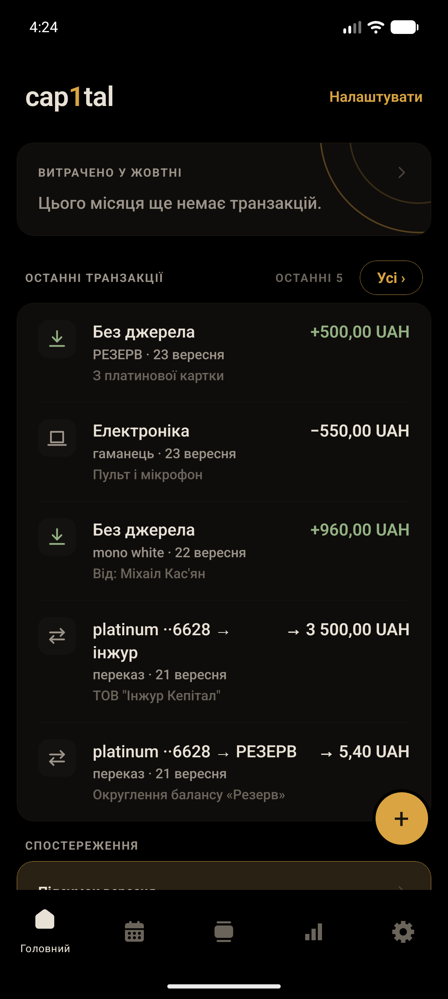 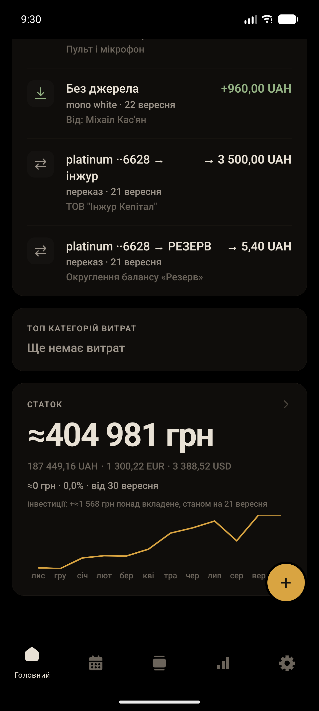 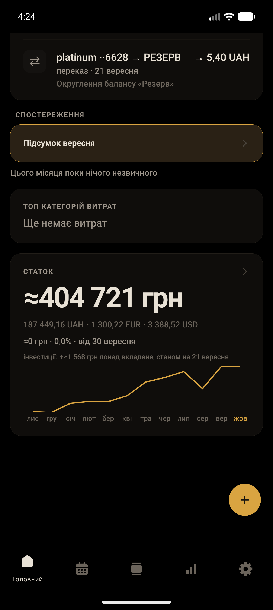

[src/app/(tabs)/index.tsx](<../src/app/(tabs)/index.tsx>) · спеки `main-screen`, `net-worth`,
`dashboard-layout`

Зверху — логотип застосунку і поруч дія **«Налаштувати»** (48×48 dp), яка відкриває окремий екран
редагування дашборду (§4.10); вона тільки відкриває екран — жодної синхронізації, жодного запису.
Далі, якщо є токен monobank і хоч один зв'язаний рахунок, **рядок свіжості** з кнопкою «Оновити»
поруч. Свіжість каже, скільки банку застосунок насправді чув: поки синхронізувалися не всі
зв'язані рахунки — `Синхронізовано 3 з 9 рахунків` і жодної дати; коли всі — `оновлено 3 хв тому`,
і це вік **найстарішої** із завершених синхронізацій, бо стільки років картині цілком, а не її
найсвіжішому куточку. Поки йде прогін, рядок каже саме це. «Оновити» і **потягнути вниз** роблять
те саме: примусову синхронізацію — тихий інтервал стосується лише прогонів, яких власник не
просив, а це прогін, який він попросив. Без токена чи без зв'язаного рахунку жест просто
перечитує сховище: жодного запиту, жодної відмови. Рахунок, якого токен більше не показує
(закрита картка), у цьому підрахунку не бере участі.

Одразу під шапкою — **службовий рядок**, який не входить у дашборд і тому ніколи не ховається й не
переставляється: запрошення створити рахунок, коли жодного немає; банер «Без категорії», коли є
хоч одна витрата чи повернення без категорії (рахується по всій історії; тап → «Транзакції», уже з
фільтром «Без категорії», §3.8); і щонайбільше два згорнуті операційні рядки, лише коли є що
показати — скільки чернеток зі сповіщень банків чекає (тап розгортає список — підтвердити або
відхилити просто тут, без переходу нікуди) і невдача monobank, але лише коли є що робити:
відхилений токен показується одразу (полагодити може тільки власник), будь-яка інша невдача —
аж коли картина цілком застаріла понад добу; тап веде на екран monobank. Немає жодного з цих
рядків — рядка немає взагалі, без заголовка й без зарезервованого місця.

Нижче службового рядка — **відомі віджети дашборду**, у порядку й видимості, які власник обрав в
екрані редагування (§4.10). Їх п'ять: «Витрачено цього місяця», «Останні 5 транзакцій», «Топ
категорій», «Статок» і «Прогрес». Типовий вигляд свіжого встановлення — перші чотири, у цьому
порядку; «Прогрес» прихований.

**Картка місяця**: «Витрачено у <місяці>» головною цифрою, по кожній валюті окремо, тими самими
числами, які показує «Місяць» (тап по картці веде на поточний місяць — навіть якщо перед цим там
було обрано минулий). Це коротше з двох щоденних питань застосунку — куди пішли гроші, а не
скільки лишилось; «залишилось» і решта п'яти чисел лишились на «Місяці», за той самий тап. Якщо
за місяць ще немає жодної транзакції, картка каже це просто, не позичаючи числа в минулого місяця.

**Останні 5 транзакцій** — стрічка з кнопкою **«Усі ›»**, що веде на всю історію. Кожен рядок
починається плиткою-піктограмою за типом транзакції; суму видно біля заголовка, а опис, рахунок і
дата — під ним на всю ширину. У стрічці видно все, що застосунок вважає важливим:

- **«Без категорії»** підсвічено крапкою і має кнопку «Обрати категорію» — категоризація в один
  тап: спершу п'ять категорій, до яких власник тягнувся востаннє, решта за кнопкою «Всі категорії
  (N)» з пошуком; поруч для витрати стоїть «Це переказ» — відкриває редагування вже з типом
  «переказ», і нічого не пишеться, доки власник не збереже. Після вибору категорії, якщо в
  транзакції є опис, застосунок пропонує одразу запам'ятати це **правилом** (шаблон з опису
  можна поправити; відмова категорію не скасовує);
- напрям грошей явний у самій сумі: витрата зі знаком «−», дохід і повернення — «+», коригування —
  своїм знаком, переказ — стрілкою `рахунок → рахунок` з обома сумами, коли вони різні (комісія);
- категорія, що перевищила свій ліміт у місяці **цієї** транзакції, — червоним.

Тап по транзакції відкриває редагування (§3.10). Прихована в редакторі дашборду — стрічки на
екрані немає взагалі, але службовий рядок вище (банер, чернетки, monobank) лишається: він потребує
уваги власника незалежно від того, що саме він обрав читати сьогодні.

**Топ категорій** — «Топ категорій витрат, <місяць>»: кільцева діаграма з сумою витрачено в
центрі (число стискається, щоб влізти в кільце, валюта — окремим рядком), до п'яти найбільших
категорій і решта одним рядком **«Ще N»**, легенда з сумами, перемикач валюти, коли валют кілька.
Коли у розбивці є від'ємна категорія (повернення переважили) або місяць порожній, кільце нейтральне,
без часток і відсотків — частки, яких немає, не вигадуються. Тап по категорії відкриває її місяць
(§3.3, праворуч на третьому знімку), тап по «Ще N» — сам місяць.

**Статок** — компактна згортка: поточна цифра (для «Усе ≈ грн» — приблизна гривня «≈», інакше точна
сума валюти), під нею завжди точні суми по кожній валюті в один рядок, зміна проти кінця минулого
місяця (зі знаком, стрілкою, відсотком і приміткою «нові рахунки», коли такі з'явилися), рядок про
поточну вартість понад вкладено, коли вона є, і графік останніх дванадцяти місяців. Свого вибору
чи пояснення на віджеті немає: тап відкриває екран «Статок» (§3.11), а віджет показує те саме
читання, яке там вибрано. Коли «Усе ≈ грн» неможливе через відсутній курс, замість графіка названо
валюти без курсу, а точні суми лишаються.

Останнім, коли власник додав його в редакторі дашборду (типово прихований), — **прогрес**:
заголовок «Прогрес», перший рядок з наявних розділів прогресу («Виклики» → «У процесі» →
«Отримані», у тому ж порядку, що на самому екрані «Прогрес», §3.6) і той самий тихий підпис про
непобачене достигнення, що й біля запису «Прогрес» на «Звітах». Тап веде на сам екран «Прогрес»;
відкриття Головного нічого тут не оцінює й нічого не позначає побаченим — тільки відкриття самого
«Прогресу» це робить.

Форми на Головному немає: записує **«+»** у правому нижньому куті — окремий екран
[transaction/new.tsx](<../src/app/transaction/new.tsx>), що виїжджає знизу, з тим самим типом,
рахунком, сумою, датою, категорією й описом. За замовчуванням це **витрата** — «будь-яка
транзакція є витратою, доки її явно не типізували інакше»; рахунок підставлено з останнього
запису, зробленого **руками** (імпорт і підтверджені чернетки його не міняють), але це лише
пропозиція. Дату ставлять без набору коду: «Сьогодні», «Вчора» і крок на день назад/вперед (вперед
— лише поки дата до сьогодні, тож майбутньої не поставити). Поки набирають опис витрати, форма
сама показує категорію, яку дають правила цього опису, — доти, доки власник не обрав свою. Після
запису екран лишається відкритим з підтвердженням над «Записати» (сума, що й як записано; комісія
чи «Відсотки», якщо додалися) і порожньою сумою, щоб наступну витрату дня можна було записати
одразу; тип і рахунок лишаються. Без жодного неархівного рахунку екран каже, що спершу потрібен
рахунок, і веде до «Рахунків».

**Довгі списки на форму не виїжджають.** Рахунок, категорія і джерело показують щонайбільше п'ять
варіантів — ті, до яких власник тягнувся востаннє, добиті з початку списку, — а решта стоїть за
однією кнопкою «Всі рахунки (N)» / «Всі категорії (N)» / «Всі джерела (N)», яка називає, скільки
їх усього. Вона розгортає повний список із пошуком по назві; вибір згортає його назад, а
апаратний «назад» спершу закриває список і лише потім іде з екрана. Обране завжди видно, навіть
якщо це архівний рахунок, на якому вже стоїть збережена транзакція, і чипи не переставляються
під пальцем. Те саме — на редагуванні транзакції (§3.10).

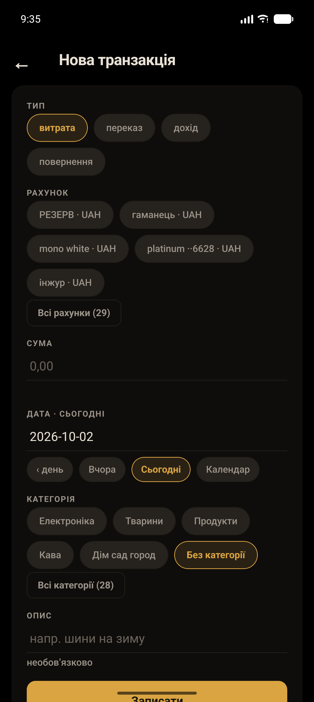 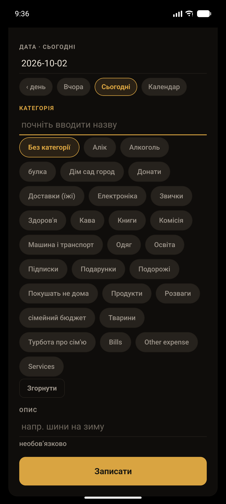

Ліворуч — «+»: п'ять рахунків і п'ять категорій, до яких власник тягнувся востаннє, кожен список
за своєю кнопкою «Всі … (N)». Праворуч — та сама категорія розгорнута: поле пошуку зверху, під ним
увесь список, обране лишається на місці.

**Рух і швидкість (для всього застосунку).** Усе, що застосунок анімує сам, вкладається у три
тривалості — 150, 220 і 300 мс — і ніколи не крутиться без причини: після зміни екран не малює
жодного зайвого кадру. Екран, відкритий поверх іншого, в'їжджає збоку, форма «+» і сканер чека —
знизу; вкладки перемикаються короткою перехресною появою. Кожен дотик підтверджується одразу
(хвиля або спільний «натиснутий» тон), смуги ліміту, кільця цілей і стовпчики «Звітів» доростають
від попереднього значення, діаграми перетікають зі старої форми в нову, а число, що змінилося,
поступається новому не лічбою через проміжні суми, а коротким згасанням. Системне «зменшити
анімацію» перетворює все це на миттєву зміну; вібрацію воно не глушить — її вимикає окремий
перемикач «Вібрація» в «Налаштуваннях». Швидкість на довгій історії тримає один запам'ятовувач
прочитаної історії: баланси, статок і звіти не перераховуються з усіх транзакцій на кожен фокус,
а вкладка читає сховище лише коли її вперше відкрили. Видно це лише в тому, що довгі списки
(§3.8, рахунок, місяць категорії) малюють лише те, що поруч з екраном, і відкриваються сторінками.

### 3.3. Місяць — куди пішли гроші і скільки лишилось

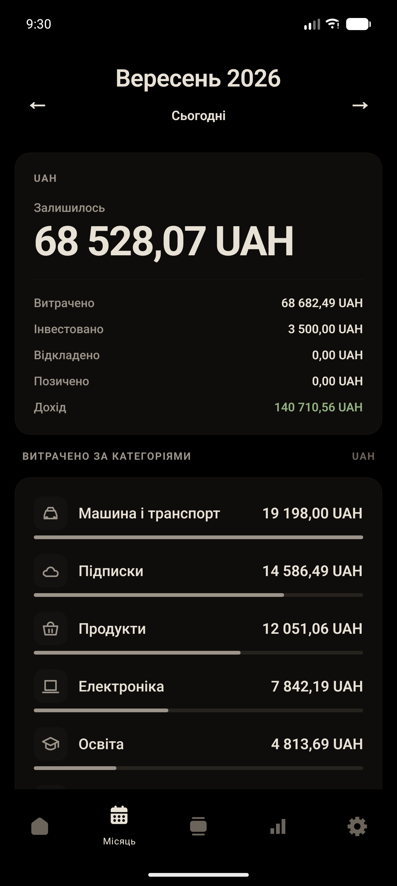 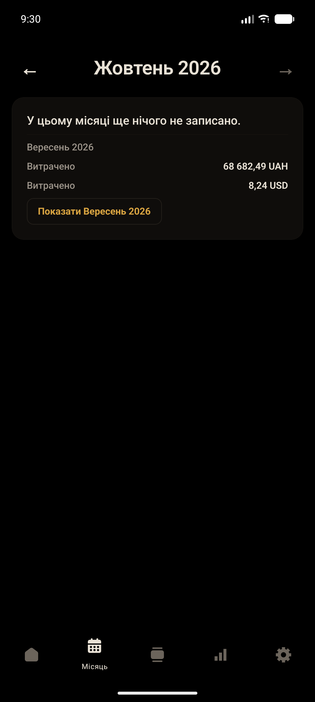 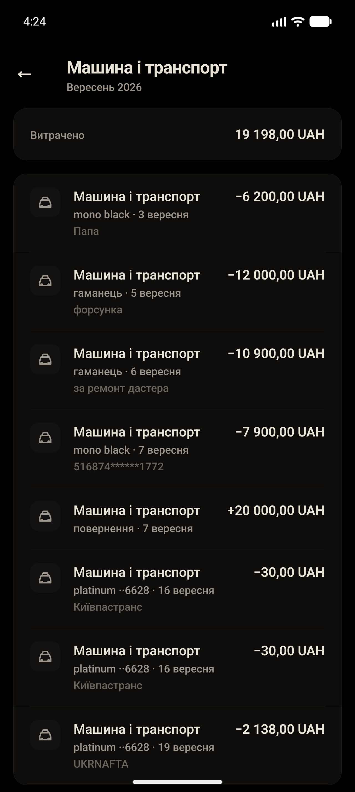

[src/app/(tabs)/month.tsx](<../src/app/(tabs)/month.tsx>) · спеки `month-screen`, `monthly-picture`

Шість чисел місяця — витрачено, інвестовано, відкладено, позичено, дохід, залишилось — окремою
карткою на кожну валюту, що рухалася цього місяця. Ведуче число картки — **залишилось**, поки в
місяці є дохід, і **витрачено**, поки його ще немає (тоді картка прямо каже, що доходу ще не
записано); решта п'яти показані завжди. `Позичено` може бути від'ємним — це повернений борг;
`Відкладено` — переказ у банку; `Інвестовано` — переказ на інвестиційний рахунок. Ліворуч —
минулий місяць, посередині — поточний, ще не завершений: стрілки ← → гортають місяці (вперед не
далі за поточний; зміст в'їжджає з того боку, куди гортають). Приблизна гривня «≈» стоїть поруч
лише коли в місяці є не-гривня і курс відомий для кожної валюти; курс тихо оновлюється, коли
застарів, і його відсутність нічого не ламає. Порожній місяць каже це, називає попередній з його
витрачено і дає одну дію перейти до нього.

Під числами — **витрачено за категоріями**: смужка кожного рядка масштабована до найбільшої
категорії тієї ж валюти, категорія понад ліміт — червона (у валюті ліміту). Тап по рядку відкриває
цю категорію за цей місяць (праворуч) з сумою, підписом, на скільки саме перевищено ліміт, а для
завершеного місяця — і словами, що місяць вклався в ліміт. Це і є місце, де читається ціль витрат.

**Розстрочки.** Коли в показаному місяці є платіж будь-якої незакритої розстрочки, нижче стоїть
блок «Розстрочки»: платежі за датою — назва, «платіж N з M», сума і стан (сплачено / очікується /
списання не знайдено), підсумок місяця і скільки з нього ще не сплачено. Тап веде на екран
«Розстрочки» (§4.11). Блок показується й у порожньому місяці, і не змінює жодного з шести чисел.
Лише для **поточного** місяця й лише в гривневій картці під `залишилось` стоїть
**«Вільно після розстрочок»**: `залишилось` мінус платежі цього місяця, що ще очікуються або не
знайдені. Сплачений платіж уже всередині `залишилось` як витрата і вдруге не віднімається.

### 3.4. Рахунки — де лежать гроші

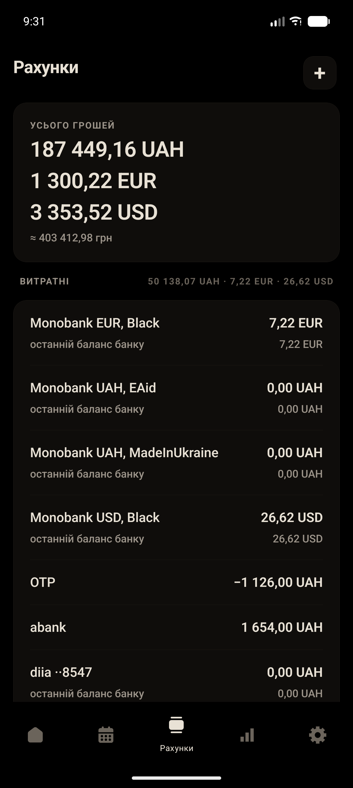 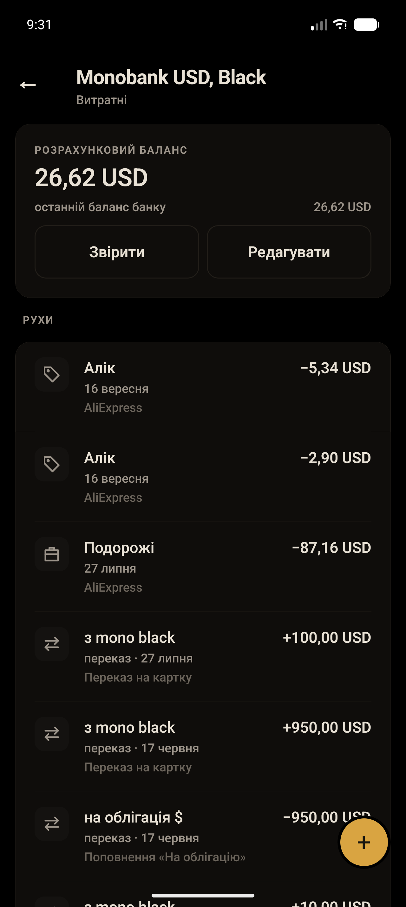 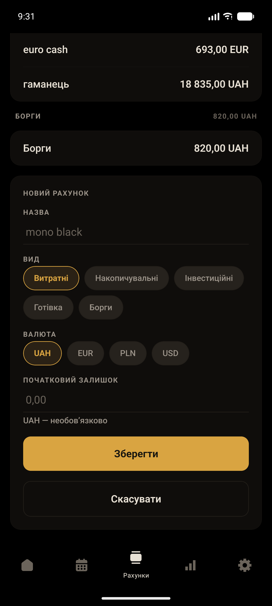

[src/app/(tabs)/accounts.tsx](<../src/app/(tabs)/accounts.tsx>),
[account/&#91;id&#93;.tsx](<../src/app/account/[id].tsx>) · спеки `accounts-screen`, `accounts`

Рахунки згруповані за видом, у кожної групи — власний підсумок по валютах; над усім стоїть
**«Усього грошей»** — один підсумок по всіх неархівних рахунках, кожна валюта своїм рядком, плюс
приблизна гривня «≈», коли курс відомий для кожної валюти (відкриття екрана тихо оновлює курси, якщо
вони старші за годину). Архівні рахунки стоять окремо і в підсумок не входять. Це **не** статок:
статок (§3.11) бере й архівні, і боргові, і інвестиції за поточною вартістю, тому числа різні, а
різницю пояснює екран «Статок». **Баланс завжди розрахунковий**: початковий залишок плюс усі
транзакції. Балансів, які не пояснюються транзакціями, не існує. Для рахунку, зв'язаного з
monobank, тут же поруч показується останній відомий **баланс банку** — поруч, а не замість: банк
ніколи не перезаписує розрахункове число.

Інвестиційний рахунок несе на своєму рядку три числа. **Вкладено** — це його ж розрахунковий
баланс, названий так, а не показаний удруге: для такого рахунку «плюс усі транзакції» і є «скільки
зайшло мінус скільки вийшло». **Поточна вартість** — єдине число в застосунку, яке власник вводить
про зовнішній світ: сума у валюті самого рахунку з датою, коли її ввели, одна на рахунок, замінна
й знімна (нуль можна — інвестиція може коштувати нічого; менше нуля ні). Між ними — **прибуток /
збиток**. Жодної транзакції запис вартості не створює, розрахункового балансу не рухає і в жодне
місячне число не потрапляє: прибуток — це не дохід. Звіряти вартість із балансом застосунок не
пропонує — коригування перетворило б прибуток на дохід і знищило б саму різницю, заради якої це
все є. Дві речі вартість таки рухає: внесок такого рахунку в ціль-накопичення і **статок**.

Тап по рахунку відкриває його рухи (посередині): назва, розрахунковий баланс, баланс банку і всі
транзакції, що торкаються рахунку, новіші зверху, сторінками. Рядок каже, що транзакція зробила
саме з **цим** рахунком: переказ, що прийшов, — «+» і «з …», що пішов — «−» і «на …». Звідси ж —
**«Звірити»**: це одна дія, поле для фактичного залишку з'являється лише після неї; власник вводить
фактичний залишок, застосунок називає різницю й тільки після підтвердження створює транзакцію-
коригування. Пропонується для кожного неархівного рахунку, інвестиційного зокрема — звіряється
фактичний залишок із розрахунковим балансом, ніколи з поточною вартістю. Тап по самому рахунку
редагування **не** відкриває: для цього є окрема дія «Редагувати» в рухах.

Праворуч — форма нового рахунку («Створити рахунок», коли рахунків ще немає, далі — «+» у шапці):
назва, вид, валюта (гривня, євро, долар), початковий залишок і, коли він не нульовий, **«станом
на»** — дата початкового залишку, яку ставлять тим самим елементом, що й дату транзакції (від неї
рахунок входить в історію статку). Вид і валюта після створення не змінюються (це змінило б сенс
усієї історії рахунку); назву, початковий залишок і дату редагувати можна. Рахунки не видаляються —
лише архівуються. Єдиний виняток — **«Обʼєднати з іншим рахунком»** (з редагування): коли банку,
підключену до monobank окремим рахунком, власник перед тим вів руками, обидва рахунки лічили одні
й ті самі гроші двічі. Обраний рахунок тієї ж валюти приймає транзакції, прив'язку monobank і
розстрочки (§4.11) рахунку-джерела, а той зникає.

### 3.5. Звіти — історія та цілі

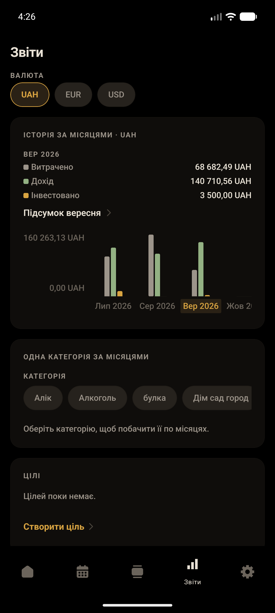 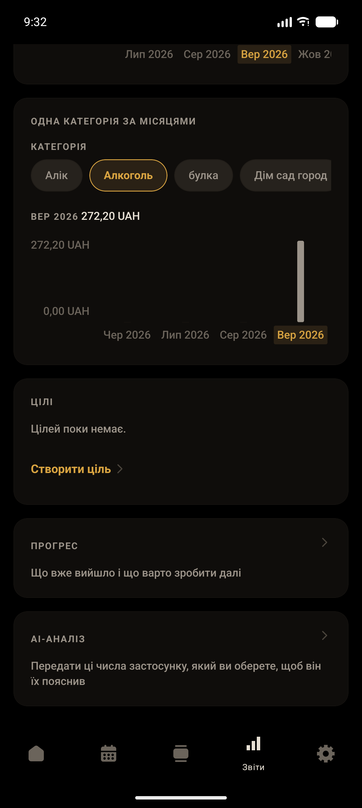

[src/app/(tabs)/reports.tsx](<../src/app/(tabs)/reports.tsx>) · спеки `reports-screen`, `reports`

Одна валюта за раз — вгорі перемикач (коли валют кілька; відкривається на гривні, якщо вона є в
історії), і вона керує обома графіками. Три секції:

1. **Історія за місяцями** — витрачено / дохід / інвестовано за весь час, стовпчиками. Кожен графік
   називає свою шкалу (максимум і нуль; нижню межу — лише коли є від'ємний місяць), а один місяць
   — вибраний, типово найновіший з будь-яким рухом — розписано числами повністю, бо стовпчик без
   числа нічого не доводить. Вибір місяця на будь-якому з графіків діє на обидва.
2. **Одна категорія за місяцями** — обрана категорія по всій історії; вибір — один рядок чипів, що
   гортається вбік, тож графік стоїть одразу під ним.
3. **Цілі** — двома окремими групами, бо це протилежні речі. **Накопичення**: прогрес як «скільки
   є / скільки треба», відсоток, дата (якщо є) і скільки рахунків рахується; приблизний прогрес
   позначено «≈», а невідомий курс ховає прогрес цілком. **Ліміти витрат**: витрачено / стеля за
   поточний місяць і скільки ще можна витратити — або на скільки перевищено, і тоді жодного
   відсотка; ліміт архівної категорії стоїть окремо, щоб його можна було знайти й зняти. Рядок
   накопичення відкриває свій розбір (`goal/[id]`, §4.3a), рядок ліміту — місяць його категорії.
   Коли цілей немає, секція каже це і веде до їх створення одним тапом.

Нижче — два входи, що самі нічого не рахують: **«AI-аналіз»** (§3.7) і **«Прогрес»** (§3.6, із
тихою позначкою про непобачене досягнення). Вибір місяця, категорії чи валюти перераховує лише те,
що від нього залежить; решта читається один раз на читання сховища.

### 3.6. Прогрес — що вже вийшло і що варто зробити далі

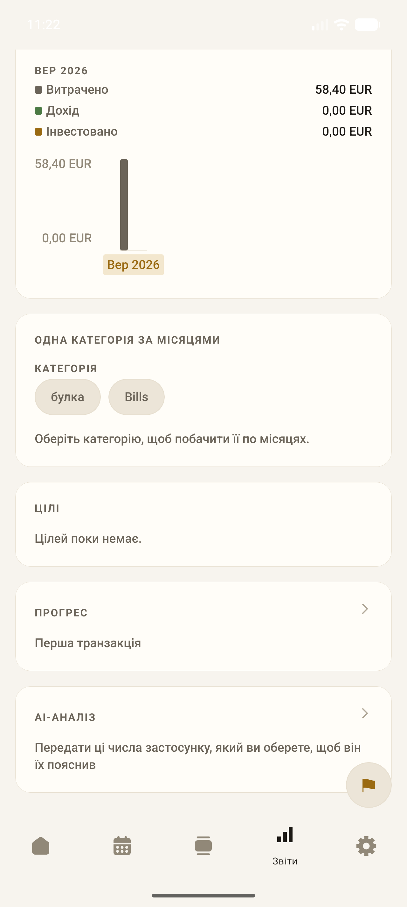 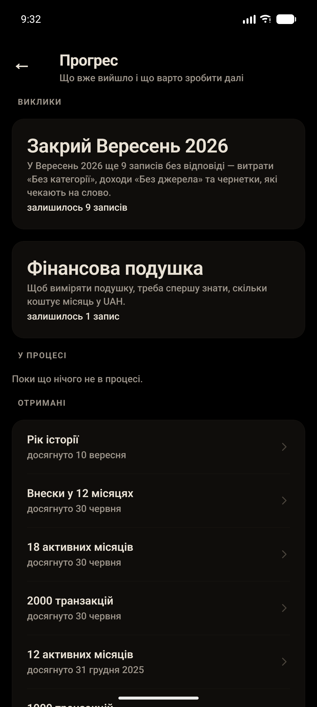 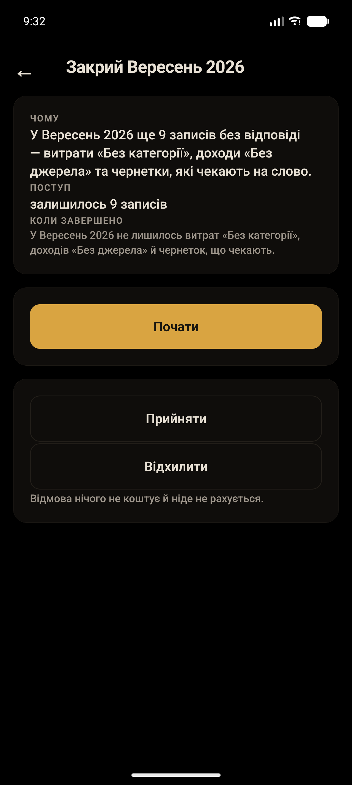 

[src/app/progress.tsx](../src/app/progress.tsx),
[src/app/achievement/\[key\].tsx](../src/app/achievement/[key].tsx),
[src/app/challenge/\[key\].tsx](../src/app/challenge/[key].tsx), [src/progress/](../src/progress/) ·
спеки `achievements`, `challenges`, `progress-screen`

Відкривається зі «Звітів», над вкладками — п'ятої вкладки з нього не робили. На Головному його
типово немає: це необов'язковий віджет, який власник може додати в редакторі дашборду (§4.10), і
тоді він показує перший рядок з наявних розділів і той самий тихий підпис. Поруч із записом
«Прогрес» на «Звітах» — тиха позначка: назва одного непобаченого досягнення, або, коли їх кілька,
один рядок «Ви вже маєте N досягнень»; немає непобаченого — немає й позначки (перший знімок).
Читання «Звітів» чи Головного нічого не позначає побаченим — лише відкриття самого «Прогресу»
це робить, і одразу для всіх, тож дюжина ретроактивних досягнень — одне оголошення, а не дюжина.
Жодне досягнення не приходить сповіщенням, діалогом чи звуком.

Три розділи, у цьому порядку: **«Виклики»** — щонайбільше три речі, які варто зробити зараз,
кожна з причиною, прогресом і однозначним «коли завершено»; **«У процесі»** — досягнення, до яких
є що міряти (немірне не показується як 0 %); **«Отримані»** — вже досягнуте, новіше вгорі, з
датою, компактним списком. На порожньому пристрої екран одним реченням каже, що тут поки нічого.

**Досягнення** — постійний факт, який застосунок довів із власних транзакцій: перша транзакція,
100/500/1000/2000 транзакцій, 3/6/12/18 активних місяців, рік історії, чистий місяць і серії
чистих місяців (3 і 6), чверть/пів/цілий місяць витрат у резерві, перший внесок в інвестиції,
внески у 3/6/12 місяцях, інвестовано на 1/3/6/12 місяців витрат і чотири про цілі-накопичення.
Отримане **не забирається**: пізніше редагування історії його не скасовує, а сама відмітка їде в
бекап. Дата — та, яку дає історія («досягнуто …»), а якщо умова — це баланс, то день, коли
застосунок це помітив («помічено …»). Розбір (четвертий знімок) показує обидва числа поруч:
**свідчення** — як було тоді, і перерахований показник — як є зараз.

**Виклики** — рівно п'ять, за порядком пріоритету: «Закрий <місяць>» (витрати «Без категорії»,
доходи «Без джерела» і чернетки завершеного місяця), «Фінансова подушка», «Ціль — до наступних
25 %», «Втримай ліміт» (три завершені місяці під лімітом), «Інвестиційна звичка». Прогрес кожного
рахується з даних щоразу, зберігається лише рішення власника (прийняти / відкласти); кожна дія
відкриває вже підготовлену роботу (форму переказу на накопичувальний рахунок, місяць із потрібним
фільтром). Розбір виклику (третій знімок) називає причину, показує прогрес і чекає одну дію.
Ніщо не просить витрачати, відкривати застосунок чи робити те, чого застосунок не може перевірити.

Гроші міряються **місячними нормами витрат**, а не круглими сумами: застосунок пропонує медіану
«витрачено» за останні шість завершених активних місяців тієї валюти й показує, які саме, а
власник підтверджує число або вписує своє. Поки норми немає — немає й досягнення, що її потребує:
не «замкнене», а просто відсутнє.

Це не гра: ні очок, ні рівнів, ні серій відкривань застосунку, ні рейтингу, ні конвертації між
валютами. Ніщо не винагороджує витрачання. Прогрес не потрапляє в пакет для AI-аналізу (§3.7) і
нікуди не публікується.

### 3.7. AI-аналіз — попросити асистента пояснити числа

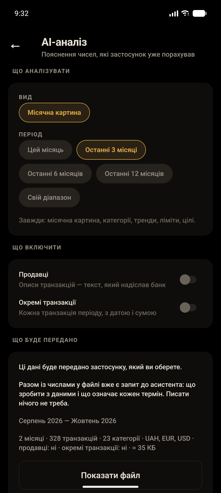 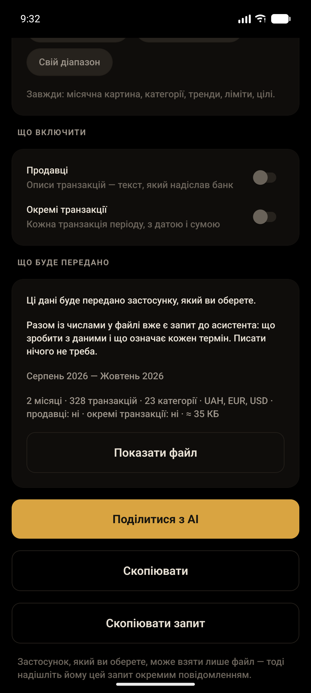

[src/app/ai-analysis.tsx](../src/app/ai-analysis.tsx), [src/analysis/](../src/analysis/) · спеки
`ai-analysis-screen`, `ai-analysis-package`, `ai-analysis-share`

Відкривається зі «Звітів». Числа рахує застосунок — асистент лише читає їх уголос: що змінилося,
які категорії зросли, що виглядає необов'язковим. Він нічого не рахує, нічого не змінює, і відповідь
назад у застосунок не повертається: що власник робить із нею, він робить звичайними екранами,
руками. Це передача файлу власною рукою власника, а не з'єднання застосунку.

Власник обирає **вид** («Місячна картина»), **період** («Цей місяць», 3, 6, 12 місяців або свій
діапазон цілих місяців; недописаний місяць екран тлумачить словами, а не помилкою) і два
перемикачі, обидва **вимкнені** щоразу, коли екран відкривається: «Продавці» (описи транзакцій —
текст банку) і «Окремі транзакції». Агрегати — місячна картина, категорії, тренди, ліміти й цілі —
включені завжди. Порожній період «Поділитися» не пропонує; період менш ніж з двома місяцями —
попередження, що тренду не буде, але передати можна.

**Що з телефона не виходить ніколи:** жоден ідентифікатор, жодна назва рахунку, токен monobank,
баланс банку, текст перехоплених сповіщень, чернетки, відстежувані застосунки, бекап, досягнення й
виклики. Описи й окремі транзакції виходять лише тоді, коли власник увімкнув їх для цього одного
запуску, і це ніде не запам'ятовується.

**Файл для аналізу — п'ять розділів, у цьому порядку:** «Запит» (звичайною українською: це пакет
фінансових даних із cap1tal, вид і період, просьба дати практичний огляд; стоїть найвище, бо файл
приходить у чужий застосунок вкладенням, а асистент читає початок), «Інструкції» (лише ці дані, нічого
не вигадувати й не перераховувати, не поєднувати валюти, не прогнозувати), «Контекст» (визначення
термінів), «Підсумок» (читабельні числа) і «Дані» (пакет як JSON). Увімкнений перемикач додає в
інструкції рядок, що це контекст поруч з агрегатами, який не можна підсумовувати.

Перед тим як щось піде кудись, екран показує **прев'ю того самого пакета**: скільки місяців,
транзакцій, категорій, які валюти, продавці так/ні, окремі транзакції так/ні, розмір у КБ, а
«Показати файл» розгортає текст цілком. Нічого не залишає телефон, доки власник не натисне
«Поділитися з AI»: тоді відкривається **системний вибір застосунків**, і вибирає власник. Телефон
не каже, що власник там зробив, тому екран каже рівно «Файл передано системі». Файл живе в
приватному сховищі, по одному, і в бекап не потрапляє.

Поруч завжди дві копії: «Скопіювати» — весь файл, і **«Скопіювати запит»** — один-два речення, для
випадку, коли обраний застосунок узяв вкладення і нічого більше (пояснення стоїть біля кнопки
заздалегідь). Короткий запит **за задумом ненадійний**: системне «Поділитися» не несе текст разом
із файлом, тож жоден адаптер його не передає, і екран ніколи не каже, що запит кудись пішов.
Правду тримає сам файл, який відкривається своїм «Запитом». Жоден асистент ніде не названий.

### 3.8. Транзакції — уся історія і пошук

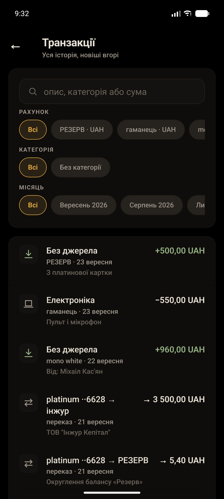

[src/app/transactions.tsx](../src/app/transactions.tsx) · спеки `transactions`, `transaction-search`

Стрічка Головного показує останні 5 — цього достатньо щодня і замало, щоб знайти щось за липень.
Цей екран тримає всю історію, найновіші зверху, **сторінками без стелі**: «Показати ще» дочитує
лише наступну сторінку й не зсуває вже показані рядки. Пошук (поле «опис, категорія або сума»)
шукає за описом, категорією, джерелом і сумою (сума збігається за будь-якою ногою переказу й
будь-якої валюти), без огляду на регістр; набране з'являється одразу, а список перешукується
лише коли набір спинився на чверть секунди. Фільтри — по одному рядку чипів, що гортається вбік:
**рахунок** (спершу ті, яких торкалися останні транзакції), місяць і **«Без категорії»**. Останній —
рівно те, що рахує банер «Без категорії» на Головному (витрати й повернення з «Без категорії»), і
саме з ним екран відкривається звідти (`?only=uncategorised`); це лише початкове значення, не
замок. Під цим фільтром рядок починається з опису, а не з однакового для всіх «Без категорії», і
кожен такий рядок має ту саму «Обрати категорію», що й стрічка Головного: після вибору він зникає зі
списку. Порожній результат каже «нічого не знайдено» і лишає пошук і фільтри на місці. Позначки
«Без категорії» і перевищеного ліміту — як у стрічці, кожна за місяцем своєї транзакції.

🔄 Із `merchant-normalization` пошук («опис, продавець, категорія або сума») знаходить і за назвою
продавця: «атб» дає «ATB MARKET», щойно продавець «АТБ» має написання «atb». Екран відкривається й
звуженим до одного продавця (`?merchant=<id>`, з «Транзакцій» на екрані продавця) — звуження назване
чипом «Продавець», знімається «Всі» чи «Показати все», поєднується з місяцем і рахунком.

### 3.9. Налаштування — усе, що налаштовується

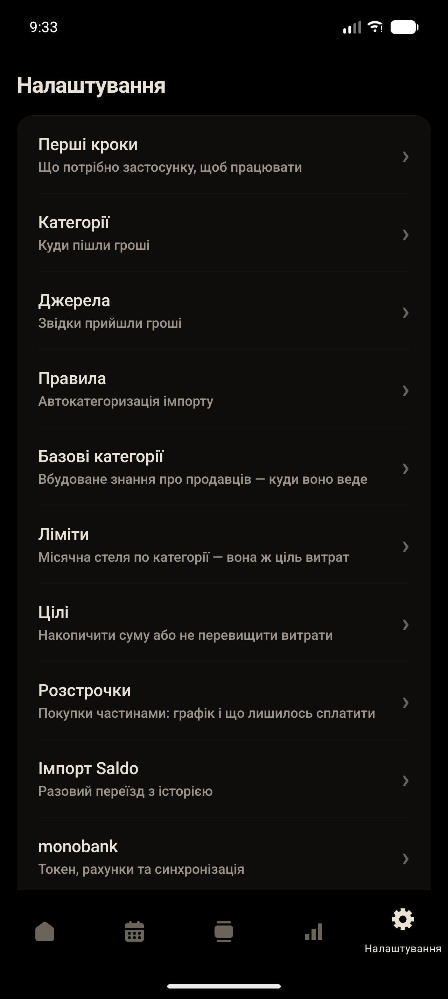

[src/app/(tabs)/settings.tsx](<../src/app/(tabs)/settings.tsx>),
[src/ui/settings-sections.ts](../src/ui/settings-sections.ts) · спека `settings-screen`

Вкладка — це список розділів, кожен з яких живе за адресою `/manage/…` і відкривається поверх
вкладок. Сам список описано **даними, а не JSX** (`SETTINGS_SECTIONS`), щоб `npm run verify`, який
ніколи не запускає екран, міг перевірити, що всі розділи на місці. Порядок: «Перші кроки»,
«Категорії», «Джерела», «Правила», 🔄 «Базові категорії» (вбудований шаблон продавців → категорії;
зміна `rule-template` реалізована в робочому дереві, але ще не злита в `settings-screen`), 🔄
«Продавці» (зміна `merchant-normalization`), «Ліміти», «Цілі», «Розстрочки», «Імпорт Saldo»,
«monobank», «Сповіщення банків», «Нагадування», «Бекап», «Google Drive», «Репорти про помилки».

🔄 **«Продавці»** ([manage/merchants.tsx](../src/app/manage/merchants.tsx),
[merchant/&#91;id&#93;.tsx](<../src/app/merchant/[id].tsx>), логіка в
[src/ui/merchants-screen.ts](../src/ui/merchants-screen.ts)) — одна назва «АТБ» для всіх написань,
якими банк пише магазин. Розділ відкривається «Без продавця»: найчастіші описи, яких жоден продавець
ще не впізнає, згруповані за запропонованим написанням (до двадцяти рядків, решта лічиться), кожен із
«Назвати». Форма назви пропонує назву й написання з опису (без службових слів банку на кшталт
«Оплата послуг»), дає «Зберегти» новий продавець або «Додати до наявного». Нижче — продавці власника
з тим, скільки транзакцій кожен впізнає; екран продавця перейменовує, додає й прибирає написання
(останнє — ні), «Обʼєднати з…» з підтвердженням, «Видалити» (відмовляє, поки правила його називають,
і веде до «Правил») і «Транзакції», звужені до нього. Кожна зміна, крім перейменування, розбирає «Без
категорії», як збереження правила. Продавець — не тег і не рівень над категорією: він читається з
опису щоразу, нічого на транзакції не зберігається. У «Правилах» правило може назвати продавця замість
тексту опису. Під розділами — перемикач **«Вібрація»** (типово ввімкнено;
застосовується з наступної дії, без перезапуску, їде в бекапі) і чесна примітка, що виходить за
межі телефона (див. §1) — вона змінюється, коли підключено Google Drive.

Розділи-списки («Категорії», «Джерела», «Ліміти», «Правила») відкриваються рядками; створення — одна
дія над списком, форма не стоїть відкритою за замовчуванням; тап по рядку відкриває його редактор
зі всіма діями, а апаратне «назад» спершу закриває відкриту форму чи редактор.

### 3.10. Редагування транзакції

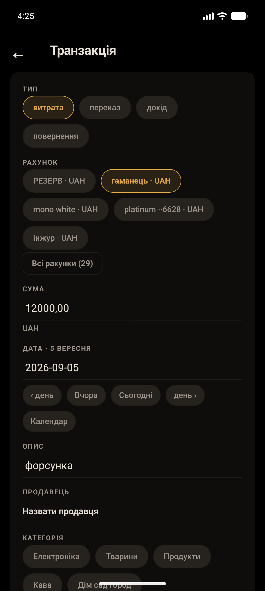

[transaction/&#91;id&#93;.tsx](<../src/app/transaction/[id].tsx>)

Та сама форма, що й швидке додавання (дата, опис, списки по п'ять — §3.2), плюс видалення з
підтвердженням. Зміна типу (витрата → переказ або інвестиція) — штатна щоденна дія, а не виняток:
саме так імпортована «витрата» стає переказом на банку. Можна й витрата ↔ повернення та
витрата ↔ дохід (повернення в дохід і навпаки — лише через витрату: повернення — не дохід); перехід
«Без категорії» → повернення питає категорію, у дохід — джерело. Переказ у витрату лишає витрату на
рахунку, звідки пішли гроші, «Без категорії». Опис можна записати, змінити чи стерти в будь-якої
транзакції, хоч би що її створило. 🔄 Під описом — рядок **«Продавець»**: назва продавця, яким
впізнано збережений опис (тап відкриває його екран), або «Назвати продавця», що відкриває ту саму
форму, що й «Без продавця»; без опису рядка немає. Стрічки й списки показують назву продавця там, де
показували опис, а редагування — опис, як він збережений. Якщо власник перетворив витрату з описом на переказ, застосунок
пропонує **правило-переказ** на щойно обраний рахунок. Переказ між рахунками однієї валюти, що
«прийшов менше», пропонує різницю як витрату «Комісія» (і не пропонує для боргових рахунків і між
валютами); погашення боргу понад основну суму пропонує дохід «Відсотки». Переказ, що виник із витрати
(зміною типу чи правилом-переказом), **вбирає свій зустрічний дохід**: дохід «Без джерела» тієї самої суми на
рахунку-одержувачі (в межах доби) прибирається, щоб гроші не лічилися двічі; а переказ, що його
ще не знайшов, чекає на нього серед майбутніх рядків виписки monobank.

Витрата, прив'язана до платежу розстрочки (§4.11), редагується як будь-яка, але зміна, через яку
вона перестає бути гривневою витратою з рахунку списання, або видалення розв'язує прив'язку — платіж повертається в стан, який дає його дата.

Тут же — **фіскальний чек**. Витрата чи повернення без чека пропонує «Сканувати QR чека»
([transaction/scan.tsx](../src/app/transaction/scan.tsx)) — помітніше для витрати в засіяній
категорії «Продукти», тихіше в інших. Сканер читає QR з паперового чека, застосунок питає
податкову за реквізитами, показує позиції з сумою і чекає рішення власника; збігу сум немає —
питає ще раз, перш ніж прикріпити. Транзакція, яка вже має чек, показує рядок «Фіскальний чек · N
позицій · сума» і веде до списку позицій ([transaction/receipt.tsx](../src/app/transaction/receipt.tsx)),
де чек можна відкріпити. Переказ, дохід і коригування сканування не пропонують — але чек, який
вони отримали до зміни типу, лишається видимим.

Чек — це **деталь під транзакцією, а не гроші**: жоден розрахунковий баланс, жодне число місячної
картини, жоден ліміт, ціль чи звіт від нього не змінюються, і жодна позиція не стає транзакцією.

🔄 Іконки категорій і піктограми рядків транзакцій за категорією — `category-icons-and-transaction-visuals`,
3 із 31 завдання, частина підключена в робочому дереві; поки що рядок гарантовано має лише
піктограму за типом.

### 3.11. Статок — вся історія за місяцями

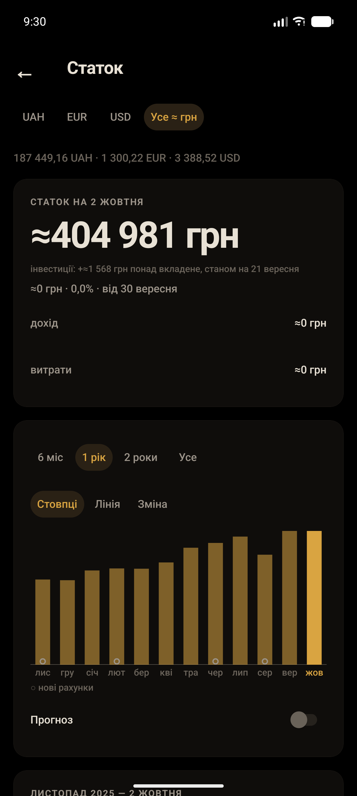

[src/app/net-worth.tsx](../src/app/net-worth.tsx),
[src/ui/net-worth-screen.ts](../src/ui/net-worth-screen.ts) · спеки `net-worth`, `net-worth-screen`

Відкривається **лише** тапом по віджету «Статок» на Головному (§3.2) і ділиться з ним вибором:
«Усе ≈ грн» (за замовчуванням, коли валют кілька і курс є для кожної) або окрема валюта; період
(«6 міс», «1 рік» — типово, «2 роки», «Усе»); вигляд — «Стовпці» (типово), «Лінія» для рівня на
кінець місяця або «Зміна» для місячних змін. Вибір переживає вихід і повернення, поки працює
застосунок.

Над графіком — статок вибраного місяця (для поточного — «на <дата>», як на віджеті), його зміна з
відсотком (десятковою комою) і, для поточного місяця, рядок про поточну вартість інвестицій понад
вкладено. Графік називає місяці під собою, має видимий нуль для від'ємних рівнів, а напрям
«Зміни» читається і не лише кольором. Місяць, у якому з'явився новий рахунок, має позначку
**«нові рахунки»**: входження рахунка — крок, а не зростання. Тап по місяцю розкладає його зміну
на **розбивку** — дохід, витрати, коригування, перекази й обмін, нові рахунки.

Нижче: підсумок періоду (зміна, середнє за повний місяць, найкращий і найгірший місяць), **таблиця
всіх місяців** періоду (доступне хронологічне читання; рядок обирає місяць на графіку), вимикач
**«Прогноз»** — типово вимкнений при кожному відкритті, лише для «Стовпців» і «Лінії» — і
«Пояснення»: внесок кожного рахунку («вкладено» біля інвестиційного, що лічиться за вкладеним,
«поточна вартість на <дата>» — біля того, що за вартістю), різниця з «Усього грошей» на «Рахунках» з
дією, яка веде туди, і підпис бази історії («≈ за поточним курсом, не за курсом на дату»).

Прогноз — це позначене продовження історії, **не обіцянка**: пунктир і смуга діапазону на шість
місяців уперед за темпом (медіана змін останніх шести повних місяців), підписане «≈ якщо темп
збережеться»; з меншою ніж шестимісячною історією його немає, і екран каже чому. На Головному
прогнозу немає ніколи. Історія реконструюється **лише із записаних балансів**: поточна вартість
інвестицій, баланс банку чи сьогоднішній курс не вважаються минулою ціною — історія інвестиційного
рахунка завжди його вкладено. Нічого з цього екран не пише і не просить.

### 3.12. Розстрочка — графік платежів


[src/app/installment/&#91;id&#93;.tsx](<../src/app/installment/[id].tsx>),
[src/ui/installment-detail.ts](../src/ui/installment-detail.ts) · спека `installments-screen`

Відкривається тапом по розстрочці в списку (§4.11). Угорі — що куплено, повна сума, щомісячний
платіж, рахунок списання, категорія, прогрес «N з M» і залишок. Нижче — **кожен платіж** з номером,
датою, сумою і станом, а для сплаченого — ще й дата та сума його списання («сплачено раніше» або
«позначено вами», коли списання немає). Стан платежу — рівно один із чотирьох: **сплачено**,
**закрито** (розстрочку закрито достроково), **очікується** (не пізніше ніж за три дні після дати)
і **списання не знайдено** (пізніше, і нічого не прив'язано).

Кожен стан має свої дієслова: прив'язаному — «Відв'язати» (застосунок більше не прив'яже цю
транзакцію до цього платежу сам); очікуваному чи не знайденому — «Обрати списання» (гривневі
витрати з рахунку списання в межах десяти днів від дати платежу) і «Позначити сплаченим»;
позначеному — «Зняти позначку». Над усім — «Редагувати», «Закрити достроково» (потім
«Відновити») і «Видалити» з підтвердженням, яке каже, що транзакції лишаються.

---

---

## 4. Налаштування по розділах

### 4.1. Категорії, Джерела

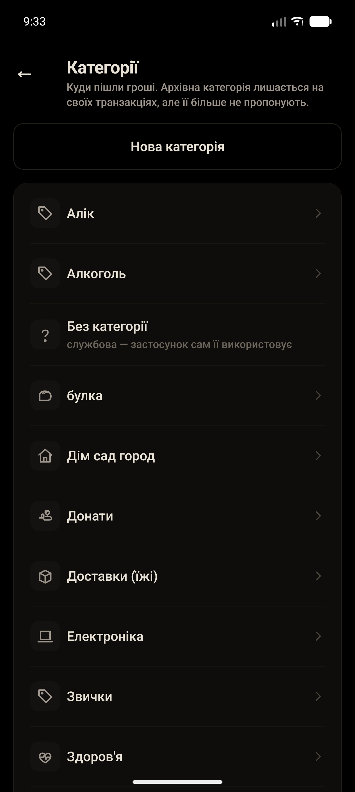 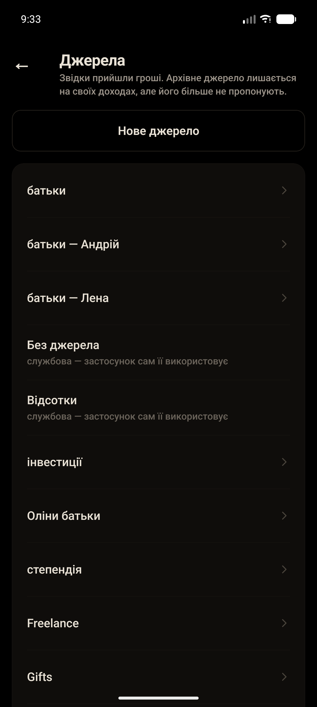

[manage/categories.tsx](../src/app/manage/categories.tsx),
[manage/sources.tsx](../src/app/manage/sources.tsx) · спека `categories`

Плоскі списки з стартовим набором власника (його ж категорії з Saldo, ієрархія розплющена;
відсутнє застосунок доводить при кожному відкритті). Список відкривається рядками; створення —
одна дія над списком; тап по рядку відкриває редактор: назва, архівація / повернення з архіву.
**Видалення немає** — архівна категорія лишається на своїх транзакціях, але більше не
пропонується. Службові рядки («Без категорії», «Комісія», «Коригування» і джерела «Відсотки»,
«Без джерела») не перейменовуються і не архівуються — застосунок сам на них посилається; з них
«Коригування» і «Без джерела» не пропонуються в жодному виборі взагалі: їх несуть лише транзакції,
які створює застосунок. Борг у Saldo («Борг») не засівається: позика — це переказ на рахунок-борг.
🔄 Іконка категорії в редакторі — частина `category-icons-and-transaction-visuals` (не завершено,
див. §3.10).

### 4.2. Правила

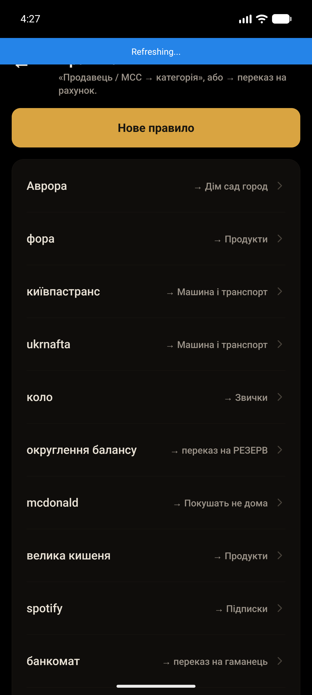

[manage/rules.tsx](../src/app/manage/rules.tsx) · спека `categorisation-rules`

«Продавець і/або MCC → категорія», або — **правило-переказ** — «→ переказ на рахунок». Форма:
«Продавець», «MCC», «Мета» (категорія чи переказ на рахунок). Обидва рангуються на одній драбині:
продавець **і** MCC → лише продавець → лише MCC; за однакової точності виграє довший шаблон
продавця, потім новіше правило. Правило без жодного критерію, або з обома цілями одночасно, не
створюється; мішенню не може бути «Коригування» і «Без категорії».

**Правила діють скрізь, де вирішується категорія:** імпорт із monobank, чернетки зі сповіщень
(правило може підтвердити розібрану витрату саме), форма «+» (категорія пропонується за описом, але
вибір власника не перезаписується), і **розбір «Без категорії»**: збереження нового чи зміненого
правила (а також зміна базової категорії, §4.2a) одразу, без питань, переводить на нього всі
витрати з «Без категорії», які воно тепер упізнає. Розбір лише заповнює порожнечу — вже обрану
категорію не чіпає, видалення правила нічого не відсуває назад. Правило-переказ бере участь лише
там, де відомий рахунок, з якого пішли гроші (monobank, розбір), і лише в тій самій валюті; ручний
запис і чернетка вирішують категорію, минаючи його. Правила не діють на дохід, переказ і
повернення.

Після того як власник призначив категорію витраті з описом, застосунок **пропонує запам'ятати
рішення як правило**: шаблон продавця вже підставлено з опису (перші одно-два слова літерами, без
номера відділення й міста) і його можна поправити; нічого не зберігається без згоди. Пропозиції
немає, коли таке правило вже діє. 🔄 Службові слова банку на початку опису («Оплата послуг»,
«Покупка», «Payment»…) пропускаються, тож «Оплата послуг АТБ-Маркет» пропонує «атб». Коли опис уже
впізнано як продавця, пропонується «продавець АТБ» — з можливістю замінити його текстом опису.

### 4.2a. Базові категорії — вбудований шаблон категоризації

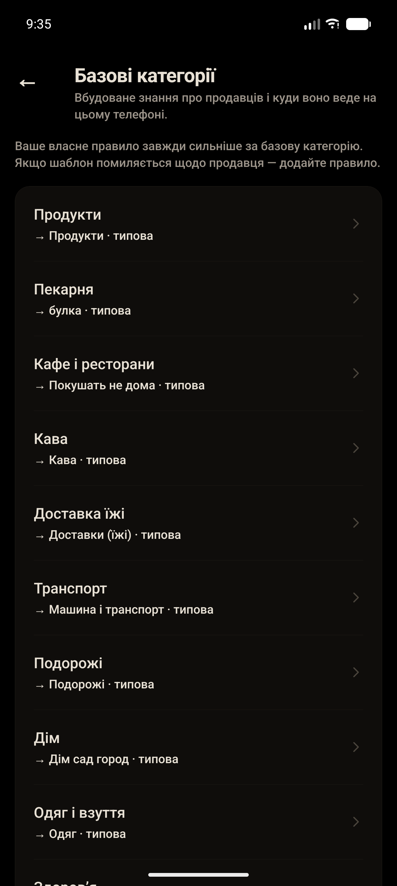

[manage/rule-template.tsx](../src/app/manage/rule-template.tsx),
[src/domain/rule-template.ts](../src/domain/rule-template.ts),
[src/ui/rule-template-screen.ts](../src/ui/rule-template-screen.ts) · спеки `categorisation-rules`,
`settings-screen` (🔄 `rule-template` — виконано, ще не закомічено й не архівовано)

Нічого про «АТБ → продукти» чи «MCC 5411 → продукти» не особисте — особиста лише назва, яку
власник дав своїй категорії. Тому застосунок **постачає знання** (**шаблон категоризації**: 22
**базові категорії** — «Продукти», «Кафе і ресторани», «Транспорт», «Дім», «Здоровʼя», «Цифрове»,
«Комунальні й звʼязок», «Алкоголь і тютюн» та інші, у кожної свої патерни продавців і MCC) і питає
лише про відповідність. Шаблон — дані в застосунку, не рядки в базі: оновлення застосунку оновлює
шаблон. Кожна базова категорія має **типову категорію** зі стартового набору, тож шаблон працює без
жодного налаштування.

Це **другий ярус**: правила власника пробуються першими й вирішують самі; лише коли жодне не
підійшло, питають шаблон. Тому правило власника завжди переважає вбудоване, а шаблон ніколи не
сперечається з рішенням — помилку шаблону виправляють власним правилом, не редагуванням шаблону.
Він діє там само, де правило: monobank, чернетки (і автопідтвердження, окрім MCC — чернетка їх не
має), форма «+», розбір «Без категорії».

Екран «Налаштування → Базові категорії» (одразу після «Правил») — меню: кожна базова категорія з
тим, у яку категорію цього телефона вона лягає, і чия це воля (типова чи власника). Тап розгортає
її: **що вона охоплює** (патерни й MCC — текстом, редагувати не можна) і дві дії — спрямувати на
іншу категорію витрат або **«Вимкнути»** (вимкнена лишається в списку). Вибір одразу запускає
розбір «Без категорії» і каже, скільки перейшло. Зберігається лише вибір власника (відсутній рядок
= типова), тому майбутня версія шаблону доходить і до тих, хто меню не відкривав. Першого
відкриття застосунку з новою версією шаблону вистачає, щоб один раз розібрати «Без категорії»
тихо, без повідомлень. Вибір їде в бекап, сам шаблон — ні.

### 4.3. Ліміти і Цілі

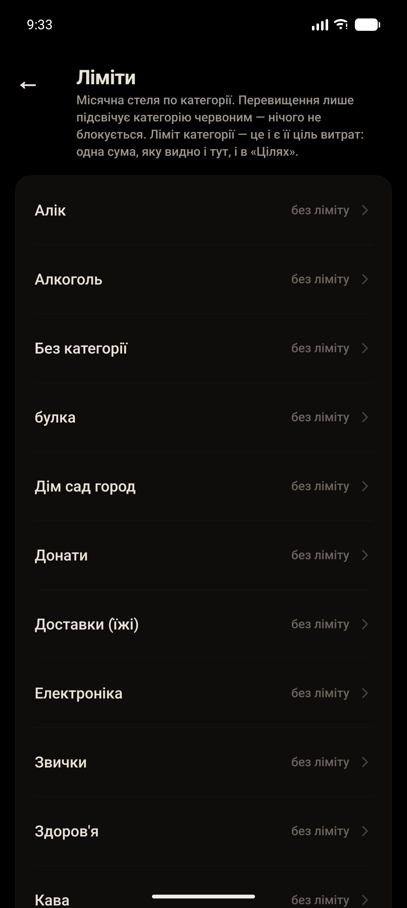 

[manage/limits.tsx](../src/app/manage/limits.tsx),
[manage/goals.tsx](../src/app/manage/goals.tsx) · спеки `limits`, `goals`

Ліміт — не більше одного на категорію (навіть службову), у своїй валюті (гривня, євро чи долар, типово
гривня); порівнюється з витраченим за місяць у тій самій валюті. Нічого не блокує і нічого не
надсилає — лише фарбує червоним. Завершений місяць має **усталений вердикт**: він змінюється, лише
коли змінюється транзакція **того** місяця, а не через витрати наступного. Ліміт архівної категорії
стоїть окремо, щоб його можна було знайти й зняти.

Ліміт — це і є **ціль витрат** цієї категорії: одна сума під двома назвами, яку ставлять і
знімають з будь-якого з двох місць, тож двох стель бути не може; секція «Ліміти» прямо каже це.

Форма цілі спершу питає вид — він після створення не змінюється. **Накопичити** — назва, сума у
власній валюті цілі, **необов'язкова** дата і склад («Що враховувати»): один чи кілька рахунків,
які відмічають вручну або ярликами «Усі інвестиційні / накопичувальні / готівкові» (ярлик відмічає
ті рахунки, що є **на цю мить**, і зберігає їхні id — створений пізніше рахунок сам до цілі не
потрапляє). Валюта цілі — гривня або єдина валюта складу; змішані валюти не в гривні відхиляються.
**Не перевищити витрати** — категорія (з тих, що ще не мають ліміту), сума і валюта; ні назви, ні
дати тут не питають. Поки відкрита форма чи редактор ліміту, апаратне «назад» закриває його, нічого
не зберігши, і лише потім виходить із розділу.

Прогрес **читається** з балансів складу — а для інвестиційного рахунку з його поточної вартості —
і ніколи не вводиться руками, тому не може розійтися зі збереженою правдою. Ціль-накопичення
читається як накопичення і ніколи як стеля; ціль витрат — як стеля і ніколи як досягнення (жодного
«виконано» чи відсотка понад стелю).

### 4.3a. Розбір цілі — `goal/[id]`


[goal/&#91;id&#93;.tsx](<../src/app/goal/[id].tsx>) · спека `goal-screen`

Екран, який відкривається з рядка накопичення у «Звітах»: прогрес із позначкою «≈», якщо щось
конвертувалося, і внесок **кожного** рахунку складу — своя сума, а поруч приблизний еквівалент у
валюті цілі, «в архіві» для архівного рахунку (він і далі рахується), «курс невідомий» для того,
який порахувати не вдалося, і поточна вартість із датою для інвестиційного. Коли курсу бракує,
тотала й відсотка немає взагалі — сума прочитаних внесків не видається за прогрес. Екран нічого не
записує.

Ціль витрат свого екрана не має: вона відкриває місяць своєї категорії, де її транзакції вже є.

### 4.4. monobank

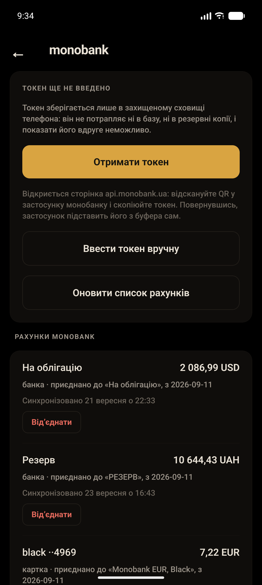

[manage/monobank.tsx](../src/app/manage/monobank.tsx), [src/monobank/](../src/monobank/) ·
спеки `monobank-sync-screen`, `monobank-sync`

**Токен.** Лежить лише в захищеному сховищі (`expo-secure-store`): ні в базі, ні в бекапі, ні в
журналі, ні в чому, що виходить назовні, окрім запитів до monobank; показати його вдруге
неможливо, екран знає лише «налаштовано / ні». «Отримати токен» відкриває сторінку токена monobank,
і після повернення застосунок **один раз** читає буфер: токеноподібне значення підставляється й
перевіряється, будь-що інше викидається нікуди не відправлене. Буфер читається лише при поверненні
звідти й за явним «Вставити з буфера» — ніколи при відкритті екрана. Є й «Ввести токен вручну». Токен
зберігається лише після того, як банк віддав читабельний client-info; відхилена заміна лишає старий
працюючий токен. «Видалити токен» не чіпає рахунків і транзакцій.

**Зв'язування.** Для кожного рахунку monobank (картка чи банка) застосунок **пропонує**: наявний
вільний рахунок тієї самої валюти за схожою назвою, або новий із назвою, валютою й підказаним
видом (банка → `savings`); коли два збіги однаково добрі — не пропонує нічого. Пропозиції
перевіряються списком, з **однією датою «Синхронізувати з»** на всіх (імпортуються елементи від
цієї дати включно), і «Приєднати все» створює всі зв'язки й нові рахунки **або жодного**. Те саме
можна зробити по одному. Зв'язок завжди з рахунком **тієї самої валюти**; один елемент виписки
імпортується **щонайбільше раз, назавжди**; «Відʼєднати» ніколи не видаляє історію грошей. Рахунок,
якого токен більше не показує (закрита картка), каже про це на своєму рядку й не старить ні рядок
свіжості, ні сповіщення. «Оновити список рахунків» перечитує картки й банки, транзакцій не
синхронізує.

**Кожен прогін починається з балансів.** Раз на хвилину банк віддає client-info (окремий ліміт від
виписки); прогін спершу читає баланси, і рахунок, чий баланс банку зрушив, стає **позачерговим** —
банк має про нього щось непрочитане. Позачерговими стають і щойно приєднані, і всі — коли власник
сам попросив синхронізацію. Рахунок без ходу понад три години — **прострочений** і йде одразу за
позачерговими, тож жвава картка не забирає всі нагоди в решти. Баланс банку лежить поруч із
розрахунковим і ніколи його не перезаписує; прогін не імпортує транзакцій, пізніших за ту відповідь
client-info, яку він використав, тож баланс і транзакції описують одну мить.

**Черга — за чеканням, а не за абеткою.** Усередині групи рахунок отримує *хід* (один запит про
нього) у порядку «хто найдовше чекав»; хід зараховується, чим би не скінчився, тож рахунок, який не
вдається завершити, коштує один запит на коло. Банк дозволяє запит на хвилину, і ця хвилина
належить телефону, а не прогону — її пам'ятають між прогонами й перезапусками. Дев'ять рахунків —
це дев'ять хвилин, а обірваний на третьому прогін наступного разу починає з четвертого; для рахунку
з довгою історією застосунок пам'ятає, де спинилось гортання, тож «перенесено» там означає поступ,
а не повтор (ці позначки — прогрес цього телефона, у бекап не їдуть).

**Коли синхронізація запускається.** (1) **Сама** — відкрив застосунок чи повернувся, і від
останньої спроби минуло понад 15 хвилин: прогін тихий, успіх нічого не каже, просто з'являються
транзакції. Час спроби пишеться **до** прогону й переживає перезапуск, тож десять force-close
поспіль коштують один запит. (2) **За проханням** — «Синхронізувати» тут, «Оновити» і жест
«потягнути вниз» на Головному: завжди питають банк заново і не зважають на 15 хвилин. (3) **У
фоні** — поки приєднано хоча б один рахунок, застосунок просить в Android нагоди приблизно раз на
чверть години, коли телефон дозволяє, жодного часу доби не обіцяючи. Фоновий прогін шле лише те, що
хвилина банку вже дозволяє (зазвичай один запит), і завершується за секунди; решта «перенесена»
до наступної нагоди з того ж курсора. Прогін завжди **один** (замок), поки триває чужий — екран
каже про це. Прогін у застосунку **поступається**, коли власник виходить із нього: спиняється перед
наступним запитом і не тримає замок.

**Дочитування і поштовх.** Коли прогін поза застосунком лишив непрочитаним позачерговий чи
прострочений рахунок, застосунок просить в Android разову нагоду — **дочитування** — щойно дозволить
хвилина банку; кожне читає ще один рахунок і, якщо треба, просить наступне, тож «Оновити» робить усі
дев'ять рахунків актуальними приблизно за десять хвилин, навіть якщо застосунок одразу закрили.
Сповіщення застосунку monobank — **поштовх** (за наявності дозволу на сповіщення, §4.5): береться
лише момент, ні заголовок, ні текст не читаються, і за хвилину з гаком іде дочитування, яке побачить
зрушений баланс. Очікує щонайбільше одне, тож балакучий monobank коштує не більше за прогін на
хвилину.

**Дозвіл працювати у фоні.** Екран каже, як Android ставиться до застосунку: дозволено; «оптимізація»
заряду (нагоди можуть відкладатися на години) — тоді кнопка «Дозволити роботу у фоні», що відкриває
системний запит; або фонову роботу вимкнено в налаштуваннях — «Відкрити налаштування застосунку».

**Свіжість.** Рядок на Головному й тут — `Синхронізовано N з M рахунків`, доки не всі, і потім
вік **найстарішої** завершеної синхронізації; кожен рядок рахунку каже свій момент.

**Невдачі.** Тихо — доки monobank не потребує власника: токен відхилено (одразу) або дані
застаріли понад добу (для «банк не відповів», «ліміт» тощо; запит, що не вдався під землею, нікого не
турбує; зупинений власником прогін — теж). Тоді рядок «Потребує уваги» на Головному, а коли
застосунок не попереду — **одне** сповіщення про збій на одну проблему (§4.6); успішний прогін
його знімає. Запит без відповіді за 30 с закінчується як «недоступно», і прогін іде далі.

### 4.5. Сповіщення банків

 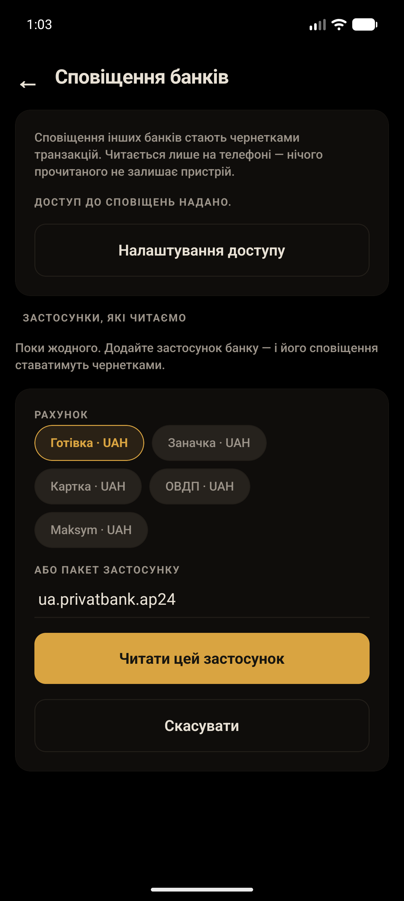

[manage/notifications.tsx](../src/app/manage/notifications.tsx), [src/notifications/](../src/notifications/),
`modules/notification-capture/` · спеки `bank-notifications`, `bank-notifications-capture`,
`bank-notifications-screen`

Як автоматично ловляться банки, у яких немає API. Власник дає Android-дозвіл на читання сповіщень
(екран спершу пояснює, що прочитане не залишає телефон) і додає **відстежувані застосунки**: один
застосунок → рівно один рахунок; можна обрати з відомих банків або вписати пакет. Сповіщення всіх
інших застосунків не читаються взагалі, перехоплене чекає на пристрої, поки його не «квитують», і
ніколи не залишає телефон. Застосунки monobank відстежувати заборонено — mono приходить через API з
реальними ідентифікаторами, а другий, слабший шлях лише наробив би дублікатів (самі сповіщення
monobank правлять лише за **поштовх** для синхронізації, §4.4, і не зберігаються).

Розібране сповіщення стає **чернеткою** на Головному (розгортається там же — підтвердити чи
відхилити): гроші не рухає, поки власник не підтвердить. Розхід → чернетка-витрата, прихід →
чернетка-дохід із «Без джерела» (стартова точка, не вирок), а непізнаний формат — «сира» чернетка з
текстом і без суми: підтвердити її можна лише з сумою, яку введе власник, у валюті рахунку. Одне
сповіщення дає щонайбільше одну чернетку, назавжди. Категорію чернетка отримує **під час
підтвердження** за правилами (§4.2), а коли жодне не підійшло — за шаблоном (§4.2a); без збігу
лягає в «Без категорії». Правило чи базова категорія можуть підтвердити розібрану витрату одразу
саме; дохід і сира чернетка не підтверджуються самі ніколи, а MCC-критерії тут не працюють — у
сповіщенні MCC немає. «Не читати» знімає застосунок із відстеження, нічого записаного не видаляючи.
Чернетки, тексти й відбитки сповіщень у бекап не потрапляють.

### 4.6. Нагадування

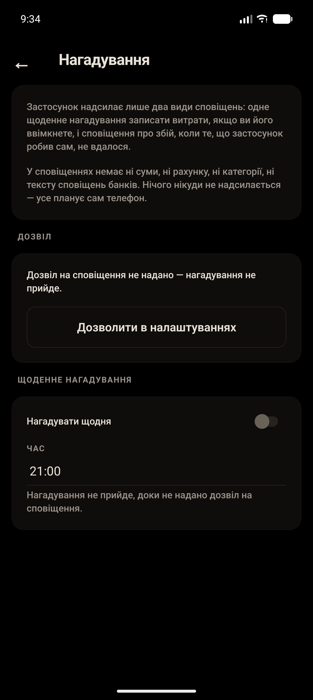

[manage/reminders.tsx](../src/app/manage/reminders.tsx), [src/reminders/](../src/reminders/) · спеки
`reminders-and-alerts`, `reminders-screen`

Застосунок надсилає **три види** сповіщень, і лише ці: (1) одне щоденне **нагадування** записати
витрати — вимкнене, доки власник не ввімкне, у вибраний час (час перевіряється, не-час відхиляється;
перемикається тут же, дозвіл системи просить лише тоді й не прикидається, що отримав); тап веде туди,
де записують день; (2) **нагадування про платіж** — рівно о 10:00 за день до очікуваного платежу
активної розстрочки, перемикач у «Розстрочках»; (3) **сповіщення про збій**, коли те, що застосунок
робив без нагляду, не вдалося: збирання сповіщень банків, синхронізація monobank, імпорт Saldo,
локальне збереження транзакції, збереження чи відновлення файлу-бекапу (і втрата доступу до
сповіщень, коли відстежувані застосунки ще є). Одна проблема — одне сповіщення, і воно називає
дію й веде на екран з подробицями та повтором; якщо цей екран уже перед очима власника,
сповіщення немає. Збої Google Drive сюди не входять — вони видимі лише в його розділі (§4.7a).

У жодному з них немає ні суми, ні рахунку, ні категорії, ні назви, ні тексту банківського
сповіщення. Віддалених push-сповіщень немає — усе планує сам телефон і під його часовий пояс. Увімкнення й час
нагадування їдуть у бекап (щоб відновлений телефон нагадував, як старий), невирішені збої — ні.

### 4.7. Бекап


[manage/backup.tsx](../src/app/manage/backup.tsx), [src/backup/](../src/backup/) · спеки `backup-file`,
`backup-file-screen`

«Зберегти у файл» робить **один файл** із датою в назві й віддає його системному вибору, куди
покласти. У ньому весь стан власника: рахунки (з датою початкового залишку), транзакції всіх
типів, категорії, джерела, правила й вибір по базових категоріях, ліміти, цілі, поточні вартості
інвестицій, зв'язки monobank з курсорами, відстежувані застосунки, **фіскальні чеки з позиціями**,
розстрочки, досягнення, рішення по викликах і норми, налаштування (розклад Головного, нагадування,
вібрація). Файл має версію формату й версію схеми, контрольне значення, і застосунок відмовляє
файлу, що пошкоджений, суперечить сам собі або написаний новішою версією.
**Не зашифрований** — хто має файл, той бачить гроші; зашифрована копія — Google Drive (§4.7a).

«Відновити з файлу» спершу **перевіряє** файл, потім показує його вміст (момент, рахунки,
транзакції, охоплені місяці) **поруч із тим, що зараз на телефоні**, і замінює лише після
підтвердження: відновлення **замінює** все без злиття й дублікатів, і або лягає цілком, або не
відбувається. Скасування в будь-який момент лишає телефон як був.

Ніколи в бекап не потрапляють: токен monobank, чернетки, тексти й відбитки сповіщень, кеш курсів,
репорти про помилки з журналом, невирішені сповіщення про збій (і Google-авторизація та код
відновлення, §4.7a).

### 4.7a. Google Drive — щоденна зашифрована копія


[manage/drive-backup.tsx](../src/app/manage/drive-backup.tsx), [src/backup/drive/](../src/backup/drive/),
[src/platform/google-auth-device.ts](../src/platform/google-auth-device.ts) · спеки
`google-drive-backup`, `google-drive-backup-screen` (✅ заархівовано 2026-10-01, але див. застереження)

Той самий бекап, але автоматичний і **зашифрований**: до власного Google Drive власника, у
**приховану теку застосунку** (`appDataFolder`; решта Drive застосунку недоступна), без коду відновлення копію не прочитає ніхто, зокрема й Google. Нічого не йде в Google, поки
власник сам не підключив.

- **Підключення.** Вхід через акаунт Google (PKCE, без секрету в застосунку) → ключ шифрування
  створюється на телефоні й лежить у захищеному сховищі → застосунок показує **код відновлення**
  (ключ, записаний так, щоб його можна було переписати), і підключення не завершене, доки власник
  не підтвердить «Я записав код». Якщо в теці вже є копії іншого телефона — пропонується
  **продовжити ту лінію** (ввести її код; правильний код сам завершує підключення) або почати нову
  (копії старої лінії тоді вже не відкриються цим телефоном — застосунок попереджає). Код можна
  показати знову, коли підключено; він не їде ні в бекап, ні на Drive.
- **Копіювання.** Принаймні раз на 24 години, на нагоді від системи; пропущене нагоняється при
  відкритті застосунку; точного часу доби застосунок не обіцяє. Якщо стан не змінився від
  останньої копії — нового вивантаження немає (екран тоді каже «копія актуальна», щоб старіючу дату
  не прочитали як мовчазну поломку). Зберігається п'ять останніх версій, і стара видаляється лише
  після того, як нова повністю лягла. «Зберегти зараз» робить копію негайно.
- **Що видно.** Підключений акаунт, дата останньої успішної копії або «ще не було», остання невдача
  з причиною, на яку власник може вплинути (збій не стирає дату останнього успіху).
- **Відновлення** — лише за явним «Відновити»: список версій за датами, названа версія й
  підтвердження «Замінити все»; копія, що не відкривається, пошкоджена або з новішої версії
  застосунку, відхиляється, нічого не змінивши. На новому телефоні версію відкриває код
  відновлення.
- **«Відʼєднати Google Drive»** зупиняє копіювання й знімає авторизацію; копії в Drive лишаються, і
  код ще їх відкриває.
- У копію не потрапляють токен monobank, Google-авторизація, ключ і його код, сирі сповіщення.

**Застереження (для власника).** Спека заархівована, але задачі 2.2–2.3 (OAuth-клієнт у Google
Cloud і його id в `app.json`) і весь димовий прогін §10 (підключення, «Зберегти зараз», збої, добовий
запуск, відновлення на чистому телефоні) у `tasks.md` не відмічені як виконані. Поки id не вписано,
збірка чесно каже «Ця збірка застосунку не налаштована на Google Drive»: код і тести готові, але
наживо з реальним акаунтом нічого не доведено.

### 4.8. Імпорт Saldo

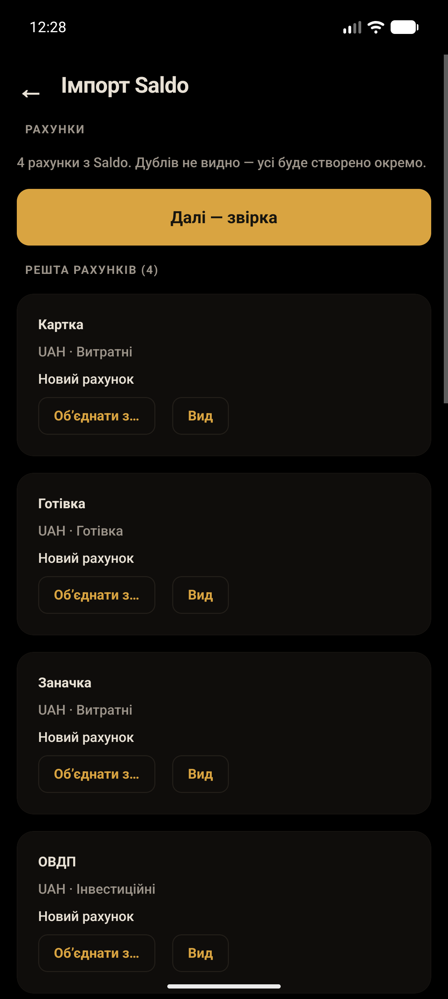 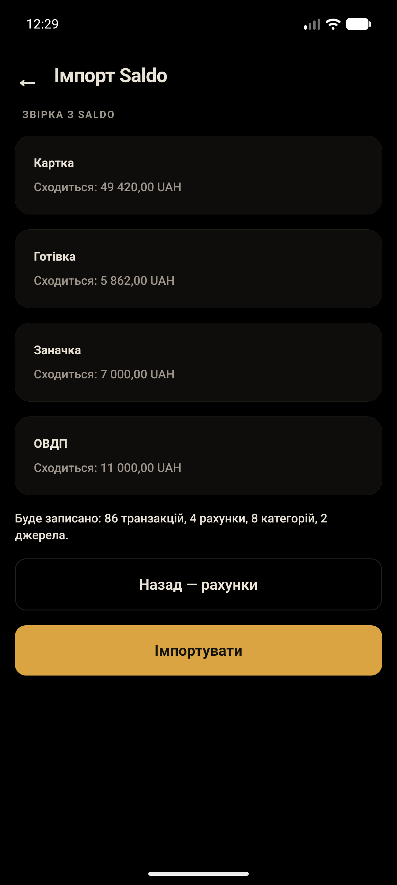 

[manage/saldo-import.tsx](../src/app/manage/saldo-import.tsx), [src/saldo/](../src/saldo/) · спеки
`saldo-import-screen`, `saldo-import`

Разовий переїзд з попереднього застосунку: обирається CSV-експорт (відхилений файл каже чому), і
майстер показує, що саме він зробить, **перш ніж зробити хоч що-небудь**; вихід до підтвердження не
лишає жодного сліду.

1. **Рахунки** — компактний список: по одному рядку на пару (рахунок Saldo, валюта), у ньому
   назва, валюта, вид і один рядок стану — «Новий рахунок», «Об'єднується з «…»» або «Додається до
   наявного «…»». У спокої не намальовано жодної фішки: види й рахунки для об'єднання з'являються
   лише тоді, коли власник відкриє їх на своєму рядку, і відкритим лишається завжди один редактор.
   «Об'єднати з…» пропонує **тільки рахунки тієї ж валюти**, найсхожіші за назвою першими, з
   пошуком, коли їх більше за п'ять, і «Створити окремий рахунок» першим — це шлях назад. Там, де
   дві назви можуть бути лише одним рахунком, рядок несе **підказку про дубль** з «Об'єднати» та
   «Ні, окремо»; сама вона нічого не об'єднує, а такі рядки згруповано вгорі «Схоже на дублі (N)».
   Крок відкривається одним рядком про те, що знайдено, і «Далі — звірка» стоїть одразу під ним:
   рядок, якого ніхто не торкнувся, стає власним новим рахунком, і це повна відповідь. Початковий
   залишок і його **дата** беруться з Saldo (найраніша дата серед об'єднаних рядків); для
   наявного рахунку він **заміняє** збережений, і звірка показує обидві заміни.
2. **Нові категорії та джерела** — те, чого ще немає за назвою; кожен рядок можна перенаправити на
   наявний (тим самим редактором з пошуком).
3. **Звірка** — по кожному рахунку баланс за Saldo і баланс за планом імпорту та різниця з
   поясненням; рядок, якого імпорт не розпізнав, потрапляє у звіт, а не зникає. Про борги майстер
   **нічого не питає**.
4. **Імпорт** — увесь план записується як одне ціле або не записується взагалі; рядок підсумку
   рахує транзакції, **створювані** рахунки, категорії й джерела (рахунок, до якого лише
   додаються, не рахується). Повторний імпорт показує, коли був попередній, і потребує додаткового
   підтвердження, бо подвоїть історію.

**Борги.** Транзакція «Борг» у Saldo стає **переказом** між реальним рахунком і рахунком-боргом
«Борги» тієї ж валюти: позика — на «Борги», повернення — назад. Таких рахунків по одному на
валюту, створюється лише коли на нього лягає хоч один переказ, імен і людей не питають, опис не
читається. Повернення більше, ніж позичено, лишається як є — звірка покаже від'ємні «Борги»
(розділення на тіло й «Відсотки» поза імпортом).

**Дати локальні.** Saldo пише час як UTC без зони, тож дата кожної транзакції — календарна дата
**у часовому поясі телефона** (день, коли власник її записав, а не UTC-день): пізній вечір UTC —
уже наступний день у Києві, і це не розбіжність у звірці. Опис рядка Saldo їде на всі транзакції,
збудовані з нього, і більше нічого не вирішує. Дві половини переказу «у дорозі» (MONEY_ON_THE_WAY)
сходяться в один переказ, а непарний відправлений рядок виходить у звіт.

### 4.9. Репорти про помилки

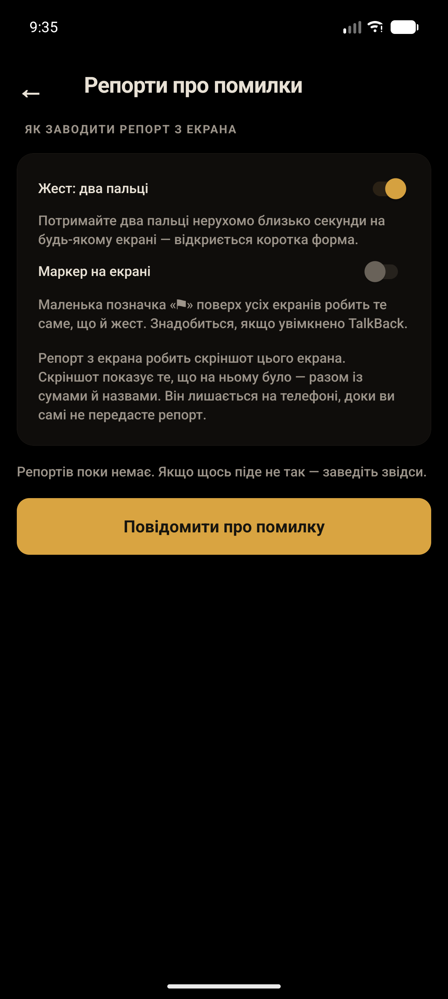 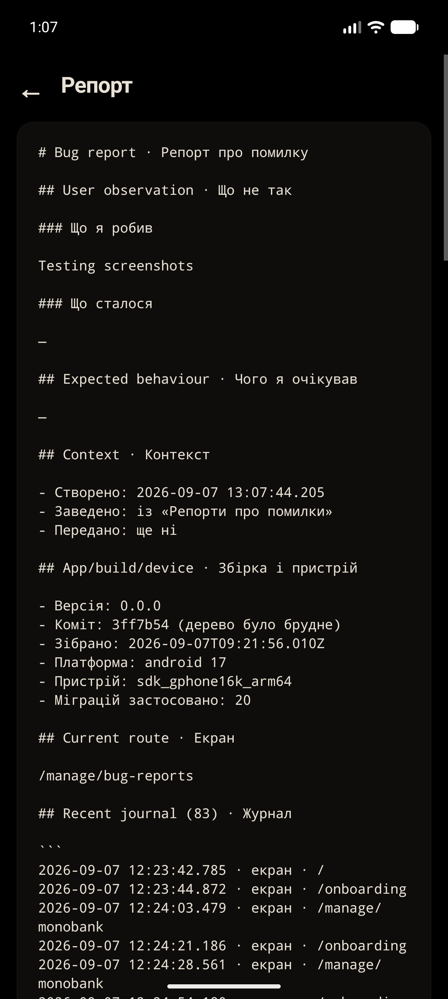


Третій знімок — аркуш репорту, відкритий жестом просто з екрана. Мініатюра в ньому показує екран
**без самого аркуша**: знімок зроблено до того, як застосунок намалював хоч щось своє.

[manage/bug-reports/index.tsx](../src/app/manage/bug-reports/index.tsx), [src/reporting/](../src/reporting/),
`modules/screen-capture/` · спеки `bug-report`, `bug-report-screen`, `bug-report-here`

Поки застосунок молодий, а тестує його одна людина на одному телефоні, помилка, яку побачили
ввечері, до ранку лишається фразою «щось не записалося». Цей розділ дає їй форму.

**Журнал.** Застосунок веде власний обмежений запис того, що робив: кожен відкритий екран (за
маршрутом), кожну дію, яка не вдалася — з точним текстом, який побачив власник, — кожне підняте чи
зняте сповіщення про збій, кожен збій з повідомленням і стеком, кожен запит, що пішов з телефона,
кожну власну роботу застосунку (синхронізацію, бекап, відновлення, імпорт, збирання банківських
сповіщень, вхід у Google, сканування чека) і те, що робив із ним сам пристрій — фонові спроби,
дозволи, вихід у фон і повернення. Запис може нести позначку операції, тривалість і виміряні
числа — саме числа, а не текст. Останні 2000 записів, старіші випадають. У журналі ніколи немає ні
суми, ні назви, ні опису, ні тексту банківського сповіщення, ні токена, ні тексту QR чека:
запит названо методом, хостом і формою шляху, дію — її видом, екран — маршрутом. Єдиний
ідентифікатор власника — рахунок monobank, якого стосувався запит чи операція. Єдиний названий
виняток — власна відмова застосунку, що цитує щойно введене власником («Рахунок «Картка» вже
існує»): цитата лишається в тому одному записі, бо без точного тексту помилку не відтворити.

**Репорт.** Власник пише рядки — що не так (обов'язково), чого очікував, — а застосунок сам додає
версію і збірку (короткий коміт і чи було дерево чистим), платформу, пристрій, кількість
застосованих міграцій, маршрут екрана, момент, увесь журнал, ту помилку, з якої все почалося,
походження репорту і кількості того, що на телефоні, — самі числа. Зверху репорт відкривається
**коротким підсумком** (запити, невдалі, найдовший, синхронізації й чим скінчилась остання), нижче —
розділ **«Мережа»** і **«Що робив застосунок»**, де записи однієї операції згруповані, а поспіль
повторені входи на екран згорнуті в один рядок. Скріншоти додаються до збереженого репорту, або
їх додає сам застосунок, коли репорт заведено з екрана.

**Звідки він береться.** Будь-який діалог з відмовою пропонує «Повідомити про помилку» і відкриває
форму з відмовою вже прикріпленою; якщо екран узагалі впав, замість мертвого застосунку —
запасний екран українською з текстом помилки, «Повідомити про помилку» і «Повернутися»; без жодного
приводу репорт заводять просто тут.

**Прямо з того екрана, де проблема.** **Жест репорту** — два пальці, потримані нерухомо близько
1,2 секунди, — працює на будь-якому екрані (у списку, прокрученому наполовину, у формі з піднятою
клавіатурою, її вміст не втрачається) і **типово ввімкнений**; двома пальцями саме тому, що одним
пальцем у застосунку робиться геть усе. Поруч — **маркер репорту**: мала «⚑» поверх усіх екранів,
**типово вимкнена**, що робить те саме; вона потрібна там, де жест не проходить, зокрема з
увімкненим TalkBack. Обидва перемикачі — вгорі цього розділу, діють без перезапуску й переживають
його; вимкнення одного не заважає решті способів.

Спершу знімок, потім усе інше: застосунок фотографує екран **до** того, як намалює хоч щось своє
(маркер ховається першим), і лише тоді відкриває **аркуш**: «Що не так?» (обов'язково), «Чого я
очікував?» (ні), сам скріншот і три дії — «Зберегти», «Зберегти й передати», «Скасувати».
«Що я робив» застосунок пише сам із маршруту. «Скасувати» (як і «назад») не лишає нічого — ні
репорта, ні скріншота, ні файлу в кеші. Якщо знімок зробити не вдалося, це не відмова: репорт
заводиться, і в ньому українською написано, чому скріншота немає.

**Скріншот — єдине, що може показати гроші.** Усе, що застосунок *пише* в репорт, грошей не несе.
Скріншот — виняток за природою: він показує те, що було на екрані. Застосунок його не читає, не
тлумачить і не замальовує — він не може знати, які пікселі є сумою. Тому перед будь-якою передачею
власнику показують сам скріншот і кажуть прямо, що на ньому суми й назви, і нічого не передають
без підтвердження; репорт без скріншота ніяким попередженням не турбують.

**Що звідси виходить.** Нічого — доки власник не скаже. Збережений репорт показано **цілим**: те,
що на екрані, і є те, що піде. «Скопіювати» кладе цей текст у буфер; «Передати» віддає один
Markdown-файл (зі скріншотами всередині) системному вибору застосунків — далі це вже чат із Claude
Code. Жодного сервера, жодної аналітики, жодного автоматичного відсилання. Репорти й журнал у
бекап не потрапляють ніколи, і відновлення їх не чіпає.

### 4.10. Налаштувати Головний — які віджети показувати і в якому порядку

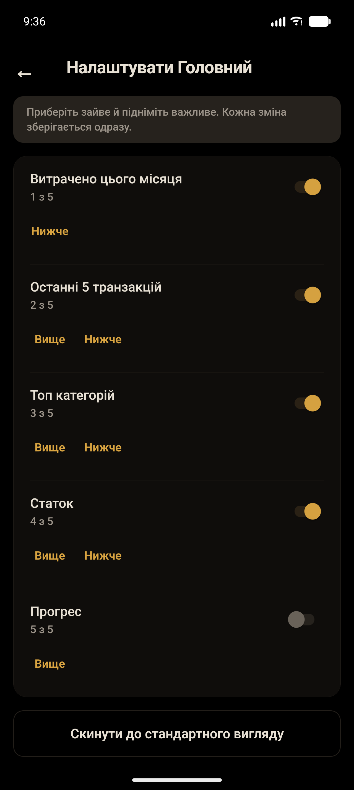

[manage/home-dashboard.tsx](../src/app/manage/home-dashboard.tsx),
[src/dashboard/layout.ts](../src/dashboard/layout.ts) · спека `dashboard-layout`

Відкривається дією «Налаштувати Головний» на шапці Головного (§3.2). Закритий список — «Витрачено
цього місяця», «Останні 5 транзакцій», «Топ категорій», «Статок», «Прогрес» — п'ять рядків, кожен зі
своєю назвою, перемикачем видимості, порядковим номером («2 з 5») і кнопками «Вище» / «Нижче»;
першого рядка немає «Вище», останнього — «Нижче», а не просто вимкнені, щоб TalkBack не називав
дію, якої немає. Сховане місце в порядку не втрачає: повернений віджет стає на своє місце, а не
дублюється. Кожна зміна — перемикач чи переміщення — записується одразу, без окремого
«Зберегти»: другого, чернеткового стану немає, і нема від чого відмовлятися, вийшовши без
збереження.

**Увага:** «Статок» — єдиний вхід на екран «Статок» (§3.11); сховавши цей віджет, власник сховає і
дорогу до історії статку, поки не поверне його звідси.

«Скинути до стандартного вигляду» питає підтвердження і повертає порядок і видимість до типових
для встановленої версії — не до якогось запам'ятованого знімка, тож майбутнє оновлення, яке додасть
новий віджет, скидання одразу покаже. Службовий рядок Головного (запрошення створити рахунок,
банер «Без категорії», чернетки, невдача monobank) сюди не входить: він завжди на місці, його не
можна ні сховати, ні переставити.

Якщо власник сховав усі віджети — Головний лишається з шапкою, дією «Налаштувати» і службовим
рядком, коли той є що сказати, і одним реченням, що віджети можна повернути звідси ж.

Дашборд, який власник склав, переживає перевстановлення й перехід на новий телефон: збережений
порядок — рядок у SQLite, який зчитується й нормалізується щоразу заново (застарілий, пошкоджений
чи з майбутньої версії запис тихо повертає типовий вигляд), і той самий рядок їде в ручному й
Google Drive бекапі як звичайне, несекретне налаштування власника — разом, однією транзакцією,
з рештою грошей при відновленні.

### 4.11. Розстрочки — що куплено частинами і що ще винен банку


[manage/installments.tsx](../src/app/manage/installments.tsx),
[src/ui/installments-screen.ts](../src/ui/installments-screen.ts),
[src/ui/installment-form.ts](../src/ui/installment-form.ts),
[src/domain/installments.ts](../src/domain/installments.ts) · спеки `installments`, `installments-screen`

Для покупки на кшталт monobank «Покупка частинами». **Розстрочка — це план, який власник вносить
руками, а не транзакція і не рахунок**: повна сума не лічиться ні у витрачено, ні в залишилось, ні в
балансі, ні в статку, ні в звітах — банк її не списує, він списує **платежі**, а кожен платіж
приходить у застосунок звичайною витратою своєї доби (monobank, сповіщення банку чи руками).
Застосунок ніколи не створює, не прибирає і не змінює суму, дату, тип чи рахунок жодної транзакції
через розстрочку; єдина зміна — категорія прив'язаної витрати, що була «Без категорії».

Вхід — «Налаштування → Розстрочки» (там її можна записати й тоді, коли в місяці ще немає платежу, а
отже й блоку на «Місяці») та блок «Розстрочки» на «Місяці» (§3.3). Екран відкривається на активних
розстрочках, найближчий платіж зверху: назва, «N з M», залишок, дата й сума найближчого платежу, а
платіж без знайденого списання названо прямо на рядку; сплачені й закриті достроково — нижче під
«Закриті»; без жодної розстрочки екран одним реченням каже, навіщо вона, і пропонує «Нова
розстрочка». Форма не стоїть відкритою за замовчуванням, а «назад» закриває її, нічого не зберігши.

Форма питає «Що куплено», «Повна сума», «Кількість платежів» (2–60), «Щомісячний платіж», «Дата
першого платежу», «Рахунок списання» (лише неархівні гривневі), «Вже сплачено платежів» і
необов'язкову «Категорію». Щомісячний платіж пропонується як рівний поділ, остання частка — решта
(тож платежі складаються в повну суму точно, а різний останній платіж форма показує окремим
рядком), доки власник не вписав свій; «вже сплачено» сама рахує платежі, дата яких до сьогодні.
Кожна відмова названа українською біля свого поля, і до її зникнення нічого не зберігається. Платіж
№ k припадає на k − 1 місяць після першого, того ж числа (у коротшому місяці — на його останній
день).

**Прив'язка списання.** Перш ніж показати платежі, застосунок сам прив'язує кожен несплачений до
його списання, якщо воно є: гривнева витрата з рахунку списання точно тієї суми, не далі ніж за три
дні від дати платежу; ближчій даті — перевага. Витрата «Без категорії» у момент прив'язки отримує
категорію розстрочки, але потім ніщо її не перекатегоризовує. Власник може відв'язати, обрати
списання вручну чи позначити платіж сплаченим без нього (§3.12), а редагування перераховує графік,
зберігаючи стан за номером платежу. «Закрити достроково» — слово власника, що все сплачено: решта
платежів стають «закрито» й більше не очікуються, не лічаться і не нагадуються.

**Нагадування про платіж.** Перемикач «Нагадувати за день до платежу» (типово ввімкнений) — одне
локальне сповіщення о 10:00 напередодні кожної дати з очікуваним платежем; тексти фіксовані й не
містять ні суми, ні назви; тап відкриває цей екран. Перший запис розстрочки один раз просить дозвіл
на сповіщення; відмову екран каже прямо й веде в налаштування телефона.

**У бекапі.** Розстрочки, стани платежів (прив'язки, позначки, відв'язані власником) і перемикач
нагадування їдуть у бекапі й відновлюються точно як були; бекап, записаний до розстрочок,
відновлюється з порожнім списком. Бекап, чия розстрочка називає неіснуючий рахунок чи категорію,
негривневий рахунок списання або невалідну прив'язку, відхиляється цілком. Питання «чи вже
просили дозвіл» — стан самого телефона і в бекап не їде.

### 4.12. Фіскальні чеки і сканування QR чека


[transaction/scan.tsx](../src/app/transaction/scan.tsx),
[transaction/receipt.tsx](../src/app/transaction/receipt.tsx), [src/fiscal/](../src/fiscal/),
`src/platform/qr-scan*.ts`, `qr-image*.ts` · спеки `fiscal-receipts`, `fiscal-receipts-screen`,
`qr-scan` (✅ заархівовано 2026-10-01; пропозиція сканувати на редагуванні транзакції — §3.10)

Паперовий чек із магазину — це склад покупки: що саме коштувало ці гроші. **Фіскальний чек —
деталь під транзакцією, а не гроші**: він ніколи не рухає розрахункового балансу, місячної
картини, ліміту, цілі чи звіту, не створює, не ділить і не змінює транзакцію, а його позиції ніколи
не стають транзакціями і не мають категорії. Одна транзакція — щонайбільше один чек, один чек —
щонайбільше одна транзакція; тотожність чека — фіскальний номер реєстратора + номер чека + дата,
тож той самий QR двічі — той самий чек, а чек, уже прикріплений до іншої транзакції, відхиляється з
назвою тієї транзакції, не переїжджаючи.

**Сканер.** «Сканувати QR чека» на витраті чи поверненні відкриває камеру. Дозвіл на камеру просять
лише по цій дії (не при запуску й не при відкритті транзакції); заблокований дозвіл веде в
налаштування застосунку; без камери (чи без дозволу) лишається **«Обрати фото»** — QR розпізнається
з наявного знімка чи файлу на пристрої, без камери й дозволу, у тому числі зі скріншота чека з
темної теми (вузьке світле поле навколо коду). Камера при **не-чековому QR** (Wi-Fi тощо) чи
чековому без реквізитів **не закривається**: підказка стоїть поруч, поки не з'явиться читабельний чек
або власник не піде. Повторена підказка лишає в журналі один рядок із причиною, без тексту QR і
значень.

**Пошук у податковій.** З QR читаються реквізити чека (фіскальний номер чека й реєстратора, дата,
час, сума — цілими мінорними одиницями без дробів); розпізнається лише посилання на сторінку
перевірки чека `cabinet.tax.gov.ua`. Це **єдине з'єднання цієї можливості** і одне з вихідних
з'єднань застосунку взагалі: запит іде **лише за явною дією власника**, несе тільки реквізити (не
позиції й не дані транзакції), і нічого не повторюється саме — фоном, після виходу з екрана чи
повторно. Відповідь — рівно один із типізованих результатів: знайдено; не знайдено (чек може
з'явитись у податковій із запізненням — «Повторити» без повторного сканування); сервіс відхилив
запит чи відповів у незнайомій формі (значить, контракт змінився й потрібне оновлення застосунку);
недоступно (офлайн, тайм-аут); нечитабельно. Документ, який приходить, розбирається детерміновано з
двох діалектів — ПРРО і класичного РРО (windows-1251), і відхиляється, якщо це не продаж чи
повернення (зміна, службовий), не фіскальний документ або не той чек, який шукали (інший
реєстратор, дата чи сума).

**Підтвердження.** Знайдений чек не прикріплюється мовчки: екран показує позиції й порівняння суми
чека з сумою транзакції (за модулем, **без допуску**). Збіг — «Прикріпити»; розбіжність чи
транзакція не в гривнях — попередження з обома сумами і вибір «Прикріпити все одно» / «Скасувати».
Різниця дати, продавця проти опису й виду (чек повернення на витраті) — лише інформація поруч і
нічого не блокує. Вихід зі сканера нічого не зберігає.

**Екран чека** («Фіскальний чек»): позиції в порядку документа **як надруковані** — сира назва, сума
рядка, кількість з одиницею й ціною за одиницю там, де вони є, знижка біля своєї позиції; нагорі —
сума чека, продавець, коли названий, дата й час, а коли сума чека відрізняється від поточної суми
транзакції — обидві, позначені. Нічого не перейменовується, не групується й не класифікується.
Читається **без мережі** — усе збережене при прикріпленні. «Відкріпити чек» після підтвердження
видаляє чек і позиції, не чіпаючи значень транзакції. Знімок документа з податкової зберігається
незмінним (щоб майбутній розбір міг перечитати його без мережі), але жоден екран його не читає.
Чеки їдуть у бекап (і в зашифровану копію Drive).

---

## 5. Як влаштовано всередині

### 5.1. Шари

```
src/domain/     чистий TypeScript: гроші, рахунки, транзакції, місячна картина, ліміти, цілі,
                правила і шаблон категоризації, звіти, статок, розстрочки, фіскальний чек (як
                значення), іконки категорій. Нічого не знає про React, базу, мережу і платформу.
src/dashboard/  закритий реєстр віджетів Головного і нормалізатор збереженого порядку
                (`layout.ts`). Без React і без репозиторію.
src/ui/         чиста логіка екранів без жодного імпорту React: розбір суми, підписи, групування,
                стан майстрів. Саме тут перевіряється те, що виглядає як «поведінка екрана».
src/app/        expo-router: (tabs)/ — п'ять вкладок; transaction/ (new, [id], scan, receipt),
                account/, category/, goal/, installment/, achievement/, challenge/, transactions,
                net-worth, progress, ai-analysis, onboarding, crash, manage/ — екрани поверх вкладок.
src/components/ спільні примітиви UI: форми, поверхні, листи (sheet), рух (motion), іконки,
                рядок транзакції, віджети Головного, тема, таби.
src/constants/  `theme.ts` — токени теми.
src/hooks/      React-хуки і місце, де порти прив'язуються до адаптерів: `*-ports.ts`
                (monobank, drive-backup, haptics, installment, progress), `use-*` (тема, фокус,
                передній план, пагінація списків, кнопка «назад», поточні курси).
src/db/         Drizzle: schema.ts + репозиторії, `repos.ts` (зв'язування); drizzle/ — міграції
                (0000…0009).
src/platform/   порти до пристрою і їхні тестові двійники; *-device.ts — нативні адаптери
                (ніколи не вантажаться тестами).
src/monobank/   API, розбір виписки, координатор синхронізації, коли синхронізувати самому,
                поступливість прогону, курс.
src/notifications/ розбір банківських сповіщень і життєвий цикл чернеток.
src/saldo/      розбір CSV, інтерпретація в транзакції, звірка балансів.
src/fiscal/     фіскальні чеки: читання QR, порт пошуку в податковій і його адаптер, декодування
                windows-1251, два діалекти документа (ПРРО і класичний РРО). Чистий TypeScript.
src/progress/   досягнення, виклики, місячна норма витрат, каталог — те, що рахує «Прогрес».
src/analysis/   пакет для аналізу і файл для аналізу: період, місяці, категорії, тренди, цілі,
                деталі, точний десятковий текст і базисні пункти, текст промпта і рендер файлу.
                Чистий TypeScript; не знає ні про базу, ні про React, ні про мережу.
src/backup/     формат бекапу, канонізація; backup/drive/ — шифрування (конверт
                XChaCha20-Poly1305), код відновлення, ротація і розклад копії для Google Drive.
src/reminders/  розклад нагадувань, сповіщення про збої, графік нагадувань про платіж розстрочок.
src/reporting/  журнал (що робив застосунок) і репорт про помилку: збирання, приватність
                (нічого фінансового), рендер у Markdown. Чистий TypeScript.
modules/notification-capture/   локальний Expo-модуль на Kotlin: Android NotificationListener
                                 (і фоновий прогін monobank, `BackgroundSyncModule`).
modules/screen-capture/         локальний Expo-модуль на Kotlin: знімок екрана для репорту про
                                 помилку, до того як застосунок намалює хоч щось своє.
patches/        patch-package для двох залежностей: `expo-task-manager` і `react-native-screens`.
```

Правило, яке тримає все це разом: **`npm run verify` ніколи не завантажує нативний модуль і не
запускає React Native**. Тому кожна взаємодія з телефоном — це *порт* (тип + тестовий двійник) в
`src/platform/`, а нативний адаптер лежить у сусідньому файлі, який порт не імпортує. Помилки —
це **значення**, а не винятки: «немає дозволу», «немає такої можливості на цій платформі»,
«користувач скасував» — це відповіді, які екран показує словами власника.

### 5.2. Дані

Одна база SQLite (`cap1tal.db`) у приватному сховищі застосунку, 42 таблиці:

| Група | Таблиці |
|---|---|
| гроші | `accounts`, `transactions`, `investment_values`, `counterpart_income_awaits` |
| списки | `categories`, `sources`, `rules` |
| шаблон категоризації | `rule_template_choices`, `rule_template_sweep` |
| бюджет | `category_limits`, `goals`, `goal_accounts` |
| розстрочки | `installments`, `installment_part_links`, `installment_part_marks`, `installment_refusals`, `installment_reminder` |
| прогрес | `earned_achievements`, `challenge_decisions`, `spending_norms` |
| monobank | `monobank_accounts`, `monobank_links`, `monobank_imported_items`, `monobank_rates`, `monobank_sync_attempt`, `monobank_request_pace` |
| сповіщення | `notification_watches`, `notification_fingerprints`, `notification_drafts` |
| чеки | `fiscal_receipts`, `receipt_items` |
| службове | `saldo_import`, `daily_reminder`, `alerts`, `entry_defaults`, `dashboard_layout`, `haptics_preference`, `drive_backup` |
| репорти | `journal`, `bug_reports`, `bug_report_capture`, `bug_report_screenshots` |

Міграцій у `drizzle/` — **10** (`0000`…`0009`; схему перебазовано в `0000`, тож старі номери з
історії більше не існують). Остання, `0009_complete_green_goblin`, додає дві таблиці шаблону
категоризації й **ще не закомічена** — лежить у дереві разом зі зміною `rule-template`.

Правила бази ([.claude/rules/database.md](../.claude/rules/database.md)):

- **гроші — цілі мінорні одиниці плюс код валюти**. Ніколи не float, ніколи не сума різних валют;
- закомічена міграція **незмінна**: зміна схеми = нова міграція + тест;
- міграції застосовуються рівно в одному місці — кореневий layout, до першого читання екраном;
- зовнішні ключі увімкнені, посилання на рахунок — `onDelete: restrict` (рахунки архівуються).

### 5.3. Куди тече одна транзакція

```
                    ручний ввід («+» → форма; категорія пропонується правилом)
                                 │
   monobank API ──► sync ────────┤   (на передньому плані, у фоні, дочитування)
                                 │
   сповіщення банку ──► parse ──►├──► src/domain/transaction ──► src/db/transactions-repo
        (чернетка → підтвердження)│         (типи, інваріанти)          (SQLite)
   CSV Saldo ──► parse ──► interpret ──► план ───────────────────────────┤
                                                                          │
   категорію вирішують: правила власника ► шаблон категоризації          │
   (src/domain/rules, rule-template) — скрізь, де вирішується категорія  │
                                                                          │
                             src/domain/monthly-picture ◄─────────────────┤
                             src/domain/reports        ◄─────────────────┤
                             src/domain/account        ◄─────────────────┤
                             src/domain/net-worth      ◄─────────────────┤
                             src/progress              ◄─────────────────┘
                                       │
              екрани Головний / Місяць / Рахунки / Звіти / Статок / Прогрес
```

Збоку від цього потоку лежать три речі, що **не створюють** транзакцій:

- **Фіскальний чек** — деталь під витратою чи поверненням (QR → податкова → позиції); грошей,
  балансів і місячних чисел не торкається.
- **Розстрочка** — план із графіком платежів; платежі лише **зв'язуються** з уже наявними
  транзакціями (списання з monobank чи ручні), сама вона транзакцій не пише й нічого не
  списує.
- **Шаблон категоризації** — вбудовані «базові категорії» (22) з продавцями й MCC; стоять
  другим ярусом після правил власника і діють там само, де правило. Мапінг на категорії
  власника зберігається, самі шаблони — ні (це дані застосунку).

Голосового вводу (`voice-entry`) у коді **немає**: зміна ще не розпочата (0/20).

Жодне число на екрані не зберігається — баланси, місячна картина, прогрес цілі, статок і
перевищення ліміту **обчислюються** з транзакцій щоразу.

### 5.4. Робочий цикл і перевірка

Робота ведеться специфікаціями (OpenSpec). Коротко:

```
/opsx:propose  →  spec-reviewer  →  /opsx:apply  →  npm run verify  →  diff-reviewer
       →  коміт  →  димовий тест на емуляторі (smoke-runner)  →  /opsx:archive
```

- `npm run verify` = `openspec validate` → lint → typecheck → тести. Менше хвилини, без емулятора
  і без нативної збірки. Це **єдиний** критерій «готово»; хук відмовляє зробити коміт, якщо дерево
  не збігається з останнім зеленим прогоном, а Stop-хук не дає закінчити хід, поки файли, які
  перевіряє `verify`, змінені, а `verify` не зелений.
- 218 файлів тестів (4410 тестів) лежать поруч із кодом (`*.test.ts`, Vitest; прогін `npx vitest
  run` 2026-10-02 — усе зелене, 14 с). База в тестах — `better-sqlite3` поверх **тих самих**
  закомічених міграцій.
- `verify` не покриває нативний код. Усе, що стосується поведінки екрана, перевіряється на
  емуляторі: `scripts/android.sh up | shot | reset | logs` ([правила](../.claude/rules/android.md)).
  Саме цим інструментом зроблено скріншоти в цьому файлі.
- Субагенти Claude Code: `spec-reviewer` (перед реалізацією), `diff-reviewer` (до `PASS` перед
  архівацією), `task-builder` (одна дрібна партія задач) і `smoke-runner` (емулятор). Скіл
  `auto-work` веде кілька смуг паралельно в git-worktree за чергою `BACKLOG.md`. `git push` —
  лише коли попросить власник.

---

## 6. Стан реалізації

Нумерація кроків — з [tech-task.md §5](tech-task.md); правда про стан — `openspec list` і
`openspec/changes/archive/` (62 заархівовані зміни, 51 специфікація в `openspec/specs/`).
Станом на 2026-10-02:

| Крок | Що це | Стан |
|---|---|---|
| 0–3 | каркас, доменна модель, схема БД, рахунки і ручні транзакції | ✅ |
| 4 | місячна картина | ✅ |
| 5 | категорії, джерела, правила (потім `rules-everywhere`, `transfer-rules` — правила діють скрізь і вміють «→ переказ») | ✅ |
| 6 | імпорт Saldo: екран, об'єднання рахунків, прості борги, компактна мапа, локальні дати | ✅ |
| 7 | синхронізація з monobank і її екран; далі — `monobank-auto-sync`, `-background-sync`, `-sync-cadence`, `-sync-fairness`, `-sync-freshness`, `-connect-flow`, коректна валюта операції | ✅ |
| 8 | сповіщення банків: рушій, Kotlin-модуль, чернетки, екран | ✅ |
| 9 | ліміти, цілі (два види), звіти (+ полірування) | ✅ |
| 10 | `investments-value` — поточна вартість, прибуток/збиток | ✅ |
| 11 | `backup-file` — бекап у файл і відновлення | ✅ |
| 12 | `google-drive-backup` — щоденний зашифрований бекап у Drive | ✅ заархівовано 2026-10-01 (див. застереження нижче) |
| 13 | `reminders-and-alerts` — щоденне нагадування і сповіщення про збої | ✅ |
| 14 | `achievements-and-financial-challenges` — «Прогрес» | ✅ |
| — | Головний: `home-daily-overview`, `home-dashboard-redesign`, `customizable-home-dashboard` (редактор віджетів), `uncategorised-filter` | ✅ |
| — | «Статок»: `net-worth-total-history`, `net-worth-history-screen` | ✅ |
| — | `installments` — розстрочки: план, графік платежів, зв'язування з списаннями, нагадування | ✅ |
| — | `fiscal-receipts` (+ `receipt-qr-prro-requisites`, `receipt-qr-keep-scanning`, `qr-image-quiet-zone`) — фіскальний чек під транзакцією | ✅ |
| — | `ai-analysis-share`, `ai-analysis-hand-off` — «AI-аналіз» і «Запит» першим у файлі | ✅ |
| — | `bug-report`, `journal-diagnostics`, `bug-report-here` — журнал, репорт, жест і маркер | ✅ |
| — | `first-run-onboarding`, `month-start-and-polish`, `daily-usability`, `shortlist-pickers`, `goals-scope-and-caps` | ✅ |
| — | `redesign-foundation`, `app-motion-pass`, `app-speed-pass`, `search-fold-speed`, `storage-locking`, `ux-pass-2026-09-23`, `qa-sweep-2026-09` — візуальна мова, рух, швидкість, надійність сховища, прогони | ✅ |
| — | `rule-template` — шаблон категоризації (22 базові категорії, мапінг, екран «Базові категорії») | 🔧 усі задачі виконано, **не закомічено**, не заархівовано (migration 0009 теж у дереві) |
| — | `category-icons-and-transaction-visuals` — іконки категорій, картинка на типі транзакції | 🔄 3/31 |
| — | `voice-entry` — голосова фраза в формі запису (лише офлайн-розпізнавання на телефоні) | 📝 0/20, не розпочато |

Що ще лежить у черзі власника ([BACKLOG.md](../BACKLOG.md)): сума в оригінальній валюті для
імпортованих із monobank операцій, відтворювана перевірка сумісності JS і нативної development
build, UX-полірування за ручним проходом iOS. Застереження: [tech-task.md §5](tech-task.md) і
`BACKLOG.md` частково відстають від архіву — там кроки 12–13 ще значаться «у роботі/в дереві»,
а `monobank-*`, `fiscal-receipts`, `customizable-home-dashboard` — «у дереві»; вірити слід архіву.

---

## 7. Свідомо поза межами v1

Це не «ще не зробили», а **вирішено не робити** (§14 візії, нумерація та сама). Пропозиція нової
фічі, яка потрапляє в цей список, потребує спершу зміни візії:

1. спільні дані, кілька користувачів, акаунти cap1tal, жива двостороння синхронізація між
   пристроями;
2. позиції та інструменти інвестицій, автоматичні ціни (лише ручна поточна вартість рахунку);
3. деталі позик людям: терміни, ставки, графіки платежів. **Звужено 2026-10-01:** безвідсоткова
   розстрочка таки несе графік місячних платежів (§4 візії); ні в чому немає відсоткової ставки;
4. «гроші в дорозі» як окремий стан — утримання це просто транзакція;
5. розділення однієї покупки на кілька категорій (фіскальний чек показує позиції, але не ділить
   транзакцію);
6. регулярні та заплановані транзакції. Графік розстрочки — план, до якого **прив'язуються**
   списання, а не транзакція, яку застосунок записує сам;
7. інтеграції з банками поза monobank API і розбором сповіщень (жодного SMS, жодного API ПриватБанку);
8. ієрархія категорій і теги;
9. хмарні сервіси, крім опційного Google Drive для бекапу;
10. прогнози («такими темпами лишиться X»). **Звужено 2026-10-01:** єдиний прогноз — опційний
    «Прогноз статку» на екрані «Статок» (вимкнений щоразу, коли екран відкривається);
    «вільно після розстрочок» віднімає договірно зафіксовані платежі й прогнозом не є;
11. перенесення транзакції в інший місяць, ніж її дата;
12. платежі й перекази **з** застосунку — він записує гроші, він їх не рухає;
13. загальний місячний ліміт (лише по категоріях);
14. віддалені push-сповіщення; щоденне нагадування, нагадування про платіж розстрочки і
    сповіщення про збої — лише локальні;
15. збірка під iOS — але ніщо в моделі не має їй заважати.

> **Розбіжність з візією (для власника).** Фіскальні чеки роблять запит до податкової — це
> вихідне з'єднання поза monobank, курсом і Google Drive. Візія §12 («Outbound connections are
> limited to…») і §14.9 цього досі не називають; зміна `fiscal-receipts` обіцяла, що власник
> розширить їх своєю правкою. Поки цього немає, п. 9 вище читається вужче, ніж робить код.

---

## 8. Як обговорювати нову фічу

Корисна послідовність питань — вона ж підказує, куди ляже код:

1. **На яке з двох питань візії це працює** — «куди пішли гроші» чи «скільки можна витратити»?
   Якщо ні на яке, це, найімовірніше, §7.
2. **Чи є для цього слово в [glossary.md](glossary.md)?** Нових синонімів не вигадуємо; якщо слова
   немає — його треба додати в глосарій, і це частина зміни.
3. **Це нова поведінка чи новий екран для наявної?** Нова поведінка потребує вимоги в
   `openspec/specs/<capability>/` — жодної зміни поведінки без специфікації, яка її описує.
4. **Де вона живе за шарами?** Чисте правило → `src/domain/`; логіка екрана → `src/ui/`; новий
   віджет Головного → реєстр у `src/dashboard/`; нове сховище → міграція + репозиторій; нова
   взаємодія з телефоном → **порт** у `src/platform/` з тестовим двійником.
5. **Чи торкається вона грошей?** Тоді: цілі мінорні одиниці, одна валюта на арифметичну операцію,
   і жодного балансу, який не пояснюється транзакціями.
6. **Як це перевіряється?** Якщо не запуском `npm run verify`, то яким сценарієм на емуляторі.

Далі — звичайний цикл: `/opsx:propose` → `spec-reviewer` → `/opsx:apply`.
